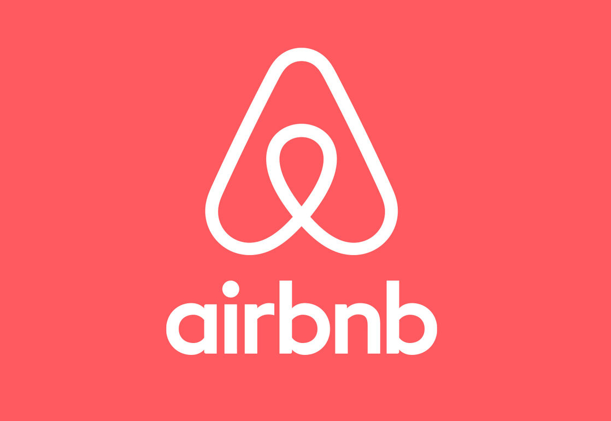

# Capítulo II: Requirements Elicitation & Analysis
## 2.1. Competidores
Después de realizar una investigación de mercado, hemos identificado tres plataformas que ofrecen características similares a las de nuestra aplicación para conectar propietarios de espacios con organizadores de eventos. Estas son:
1. **Airbnb:**
Es una plataforma en línea fundada en 2008 que revolucionó la industria hotelera al ofrecer una alternativa a los hoteles tradicionales. Permite a los usuarios alquilar alojamientos a corto plazo, desde habitaciones individuales hasta casas completas, en más de 191 países. Facilita la conexión entre anfitriones que desean alquilar sus propiedades y huéspedes en busca de alojamiento temporal.

                

2. **Vrbo:**
Es una plataforma en línea fundada en 1995 que facilita el alquiler de alojamientos vacacionales directamente a través de los propietarios. El nombre significa "Vacation Rentals by Owner" (Alquileres Vacacionales por Propietario). Es uno de los principales sitios web para alquileres vacacionales en todo el mundo, donde los usuarios pueden buscar y reservar casas, apartamentos, cabañas y villas en una variedad de destinos. Esto les permite encontrar opciones que se adapten a sus necesidades y preferencias.

                

3. **Booking:**
Es una plataforma que permite a los usuarios reservar alojamiento en hoteles, hostales, apartamentos y otros tipos de alojamiento en todo el mundo. También ofrece la posibilidad de reservar vuelos, alquilar coches y reservar actividades turísticas. Booking.com es una de las mayores plataformas de reserva de alojamiento en línea y ofrece una amplia variedad de opciones para viajeros de todo tipo. Los usuarios pueden buscar alojamientos según sus preferencias y presupuesto, y realizar reservas de manera rápida y conveniente a través de la plataforma.

                

### 2.1.1. Análisis competitivo
<table>
  <tr>
    <th colspan="7" valign="top"><b>Competitive Analysis Landscape</b></th>
  </tr>
  <tr>
    <td colspan="2" rowspan="2">¿Por qué llevar a cabo este análisis?</td>
    <td colspan="5">Escriba en el recuadro la pregunta que busca responder o el objetivo de este análisis.</td>
  </tr>
  <tr>
    <td colspan="5">Este análisis se realizó con la finalidad de poder identificar a nuestros potenciales competidores e idear estrategias y tácticas para diferenciarnos de estos.</td>
  </tr>
  <tr>
    <td colspan="3">(En la cabecera colocar por cada competidor nombre y logo)</td>
    <td colspan="1" valign="top" style="font-weight: bold;">
        AlquilaFácil
         
        

                
        

    <td colspan="1" valign="top" style="font-weight: bold;">
      Airbnb
        

                
        

    </td>
    <td colspan="1" valign="top" style="font-weight: bold;">
      Vrbo
        

                
            

        </td>
    <td colspan="1" valign="top" style="font-weight: bold;" >
      Booking
        

                
        

    </td>
  </tr>
  <tr>
    <td colspan="1" rowspan="2">
Perfil
</td>
    <td colspan="2">Overview</td>
    <td colspan="1" valign="top">Es una plataforma en línea que facilita el alquiler de una amplia gama de espacios para eventos, desde salones de eventos hasta casas y alojamientos temporales. Con una interfaz fácil de usar, conecta a propietarios con organizadores, ofreciendo una solución conveniente y eficiente para satisfacer las necesidades de ambos.</td>
    <td colspan="1" valign="top">Plataforma en línea que revoluciona el alquiler de alojamientos a corto plazo, conectando anfitriones y huéspedes en todo el mundo. Ofrece una amplia variedad de opciones de alojamiento, desde habitaciones individuales hasta casas completas.</td>
    <td colspan="1" valign="top">Plataforma en línea que permite a los usuarios buscar y reservar alojamientos vacacionales directamente a través de propietarios. Ofrece una variedad de opciones de alojamiento, como casas, apartamentos, cabañas y villas, en diferentes destinos, adaptándose a las necesidades y preferencias de los viajeros.</td>
    <td colspan="1" valign="top">Booking.com es una plataforma líder para reservar alojamiento y actividades turísticas en todo el mundo. Ofrece una amplia variedad de opciones, desde hoteles hasta apartamentos, y facilita la búsqueda y reserva según las preferencias y presupuesto de los usuarios.</td>
  </tr>
  <tr>
    <td colspan="2">Ventaja competitiva</td>
    <td colspan="1" valign="top">Proporciona una solución completa para la planificación de eventos, ofreciendo una amplia gama de espacios para eventos y una plataforma intuitiva para gestionar reservas. Con características como registro gratuito de espacios, búsqueda avanzada y servicio al cliente dedicado, Alquila Fácil simplifica el proceso de planificación de eventos para organizadores y propietarios de espacios.</td>
    <td colspan="1" valign="top">Ofrece una amplia variedad de alojamientos en todo el mundo, desde habitaciones individuales hasta casas completas, junto con experiencias locales únicas organizadas por anfitriones. Esto permite a los viajeros personalizar su experiencia y sumergirse en la cultura local.</td>
    <td colspan="1" valign="top">Se especializa en alquileres vacacionales directamente a través de propietarios, brindando a los viajeros la oportunidad de disfrutar de una experiencia más auténtica y personalizada. Con una amplia selección de alojamientos vacacionales, Vrbo ofrece opciones para todos los gustos y presupuestos.</td>
    <td colspan="1" valign="top">Destaca por su amplia oferta de alojamiento y servicios, que incluyen hoteles, vuelos, alquiler de coches y actividades turísticas. La plataforma fácil de usar permite a los usuarios encontrar y reservar alojamiento de manera rápida y sencilla, ofreciendo una solución integral para los viajeros.</td>
  </tr>
  <tr>
    <td colspan="1" rowspan="2">
Perfil de Marketing
</td>
    <td colspan="2">Mercado objetivo</td>
    <td colspan="1" valign="top">Dirigido a organizadores de eventos adultos de 18 años en adelante que buscan espacios para eventos sociales, corporativos o especiales, como bodas, conferencias, fiestas de empresa, entre otros. Además, atrae a empresas y organizaciones que buscan espacios para eventos corporativos y reuniones profesionales dirigidas a un público adulto.</td>
    <td colspan="1" valign="top">Se centra en viajeros adultos de 18 años en adelante, ofreciendo una amplia variedad de alojamientos en todo el mundo, desde habitaciones individuales hasta casas completas, para adaptarse a diferentes necesidades y preferencias de viaje. Además, apunta a grupos de amigos, parejas y familias adultas que buscan opciones de alojamiento que se ajusten a sus requerimientos y presupuestos durante sus vacaciones o escapadas.</td>
    <td colspan="1" valign="top">Está dirigido a familias y grupos de amigos adultos de 18 años en adelante que buscan alquilar casas, villas o cabañas para vacaciones o escapadas grupales. Además, atrae a parejas y grupos de amigos adultos que buscan alquilar alojamientos vacacionales para eventos especiales, como bodas, reuniones familiares o celebraciones de cumpleaños.</td>
    <td colspan="1" valign="top">Orientado a viajeros adultos de 18 años en adelante, busca ofrecer una amplia gama de opciones de alojamiento para adaptarse a diversas necesidades y preferencias durante sus viajes. También se dirige a personas que viajan por negocios, parejas en escapadas románticas, grupos de amigos en vacaciones y familias en busca de opciones de alojamiento cómodas y convenientes.</td>
  </tr>
  <tr>
    <td colspan="2">Estrategias de marketing</td>
    <td colspan="1" valign="top">Alquila Fácil destaca con marketing de contenidos, participación en eventos de la industria y alianzas con proveedores de servicios de eventos para ofrecer soluciones completas a organizadores de eventos.</td>
    <td colspan="1" valign="top">Airbnb emplea campañas publicitarias en redes sociales y colaboraciones con influencers para promocionar destinos y experiencias únicas. También utiliza programas de referidos para aumentar su base de usuarios.</td>
    <td colspan="1" valign="top">Vrbo se centra en contenido educativo en su sitio web, colaboraciones con agencias de viajes y ofertas exclusivas para atraer a familias y grupos de amigos a reservar a través de su plataforma.</td>
    <td colspan="1" valign="top">Booking.com utiliza estrategias de SEO y SEM, junto con programas de fidelización, para atraer tráfico y fomentar la lealtad del cliente a través de una experiencia personalizada.</td>
  </tr>
  <tr>
    <td colspan="1" rowspan="3">
Perfil de Producto
</td>
    <td colspan="2">Productos & Servicios</td>
    <td colspan="1" valign="top">Aplicación web que conecta a propietarios de diversos espacios, como salones de eventos, jardines y locales comerciales, con organizadores de eventos que buscan alquilar estos espacios para celebrar eventos sociales, corporativos o especiales. Proporciona una variedad de herramientas y servicios para facilitar la búsqueda, reserva y gestión de espacios para eventos.</td>
    <td colspan="1" valign="top">Plataforma en línea donde los usuarios pueden alquilar una variedad de alojamientos a corto plazo, desde habitaciones individuales hasta casas completas, en todo el mundo. Además de alojamiento, Airbnb también proporciona experiencias locales únicas organizadas por anfitriones, como recorridos gastronómicos, clases de cocina y excursiones.</td>
    <td colspan="1" valign="top">Plataforma para alquilar alojamientos vacacionales directamente a través de los propietarios. Los usuarios pueden encontrar y reservar una amplia gama de propiedades, que van desde casas y apartamentos hasta cabañas y villas, para sus vacaciones o escapadas en todo el mundo.</td>
    <td colspan="1" valign="top">Plataforma en línea que permite a los usuarios reservar una variedad de alojamientos, incluyendo hoteles, hostales, apartamentos y otros tipos de hospedaje en todo el mundo. Además de alojamiento, Booking.com ofrece la posibilidad de reservar vuelos, alquilar coches y reservar actividades turísticas para completar la experiencia de viaje del usuario.</td>
  </tr>
  <tr>
      <td colspan="2">Precios & Costos</td>
      <td colspan="1" valign="top">Los precios de AlquilaFácil varían dependiendo del lugar, el tamaño de la propiedad, servicios, y el tiempo de uso.</td>
      <td colspan="1" valign="top">El costo promedio puede variar significativamente dependiendo de varios factores, como la ubicación, el tipo de alojamiento, la época del año y la demanda local.</td>
      <td colspan="1" valign="top">Los precios en VRBO pueden variar significativamente dependiendo de la ubicación, el tamaño de la propiedad, las comodidades ofrecidas y la temporada del año.</td>
      <td colspan="1" valign="top">Los precios pueden variar significativamente según la ubicación, la temporada, la demanda y el tipo de alojamiento.</td>
  </tr>
  <tr>
    <td colspan="2">Canales de distribución (Web y/o Móvil)</td>
    <td colspan="1" valign="top">Redes sociales y aplicación web donde los usuarios pueden poner en renta su espacio o alquilar un espacio para eventos.</td>
    <td colspan="1" valign="top">Sitio web de Airbnb, aplicación móvil de Airbnb, socios afiliados y asociaciones, redes sociales y marketing digital.</td>
    <td colspan="1" valign="top">Principalmente su sitio web y su aplicación móvil, así como acuerdos de distribución con otros sitios web de viajes o agencias de viajes en línea.</td>
    <td colspan="1" valign="top">Sitio web de Booking.com, aplicación móvil de Booking, agencias de viajes en línea, alianzas con compañías de viajes, afiliados y asociados.</td>
  </tr>
  <tr>
    <td colspan="1" rowspan="5">
Análisis SWOT
</td>
    <td colspan="6">Realice esto para su startup y sus competidores. Sus fortalezas deberían apoyar sus oportunidades y contribuir a lo que ustedes definen como su posible ventaja competitiva.</td>
  </tr>
  <tr>
    <td colspan="2">Fortalezas</td>
    <td colspan="1" valign="top">Solución completa para la planificación de eventos.</td>
    <td colspan="1" valign="top">Gran comunidad de anfitriones y usuarios.</td>
    <td colspan="1" valign="top">Variedad de alojamientos en todo el mundo.</td>
    <td colspan="1" valign="top">Interfaz fácil de usar y experiencia intuitiva del usuario.</td>
  </tr>
  <tr>
    <td colspan="2">Debilidades</td>
    <td colspan="1" valign="top">Dependencia de la disponibilidad de espacios para eventos.</td>
    <td colspan="1" valign="top">Dependencia de la reputación y opiniones de los usuarios.</td>
    <td colspan="1" valign="top">Posible saturación del mercado de alquiler vacacional.</td>
    <td colspan="1" valign="top">Competencia intensa con otras plataformas de alquiler de alojamiento.</td>
  </tr>
  <tr>
    <td colspan="2">Oportunidades</td>
    <td colspan="1" valign="top">Expansión a nuevos mercados y nichos de eventos.</td>
    <td colspan="1" valign="top">Desarrollo de nuevas características y servicios para mejorar la experiencia del usuario.</td>
    <td colspan="1" valign="top">Alianzas estratégicas con proveedores de servicios de eventos.</td>
    <td colspan="1" valign="top">Aprovechamiento de la tendencia creciente del turismo y los viajes.</td>
  </tr>
  <tr>
    <td colspan="2">Amenazas</td>
    <td colspan="1" valign="top">Cambios en la regulación de alquileres vacacionales y eventos.</td>
    <td colspan="1" valign="top">Posible disminución de la demanda de viajes debido a crisis económicas o sanitarias.</td>
    <td colspan="1" valign="top">Innovaciones tecnológicas que podrían ser adoptadas por competidores.</td>
    <td colspan="1" valign="top">Posible pérdida de confianza del usuario debido a problemas de seguridad o calidad del servicio.</td>
  </tr>
</table>

### 2.1.2. Estrategias y tácticas frente a competidores
## 2.2. Entrevistas
### 2.2.1. Diseño de entrevistas
### 2.2.2. Registro de entrevistas
### 2.2.3. Análisis de entrevistas
## 2.3. Needfinding
### 2.3.1. User Personas
### 2.3.2. User Task Matrix
### 2.3.3. User Journey Mapping
### 2.3.4. Empathy Mapping
### 2.3.5. As-is Scenario Mapping
## 2.4. Ubiquitous Language