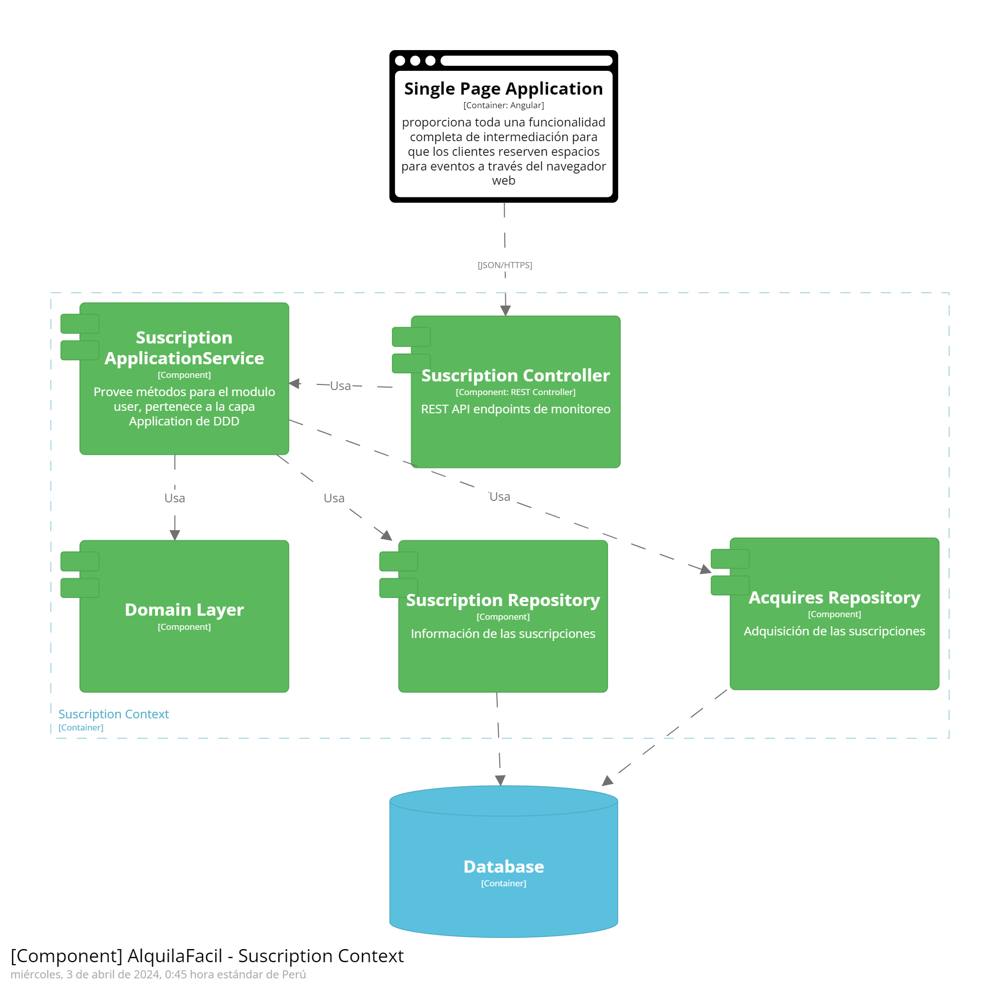
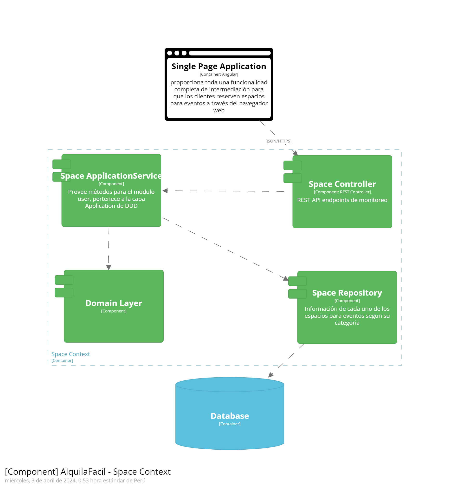
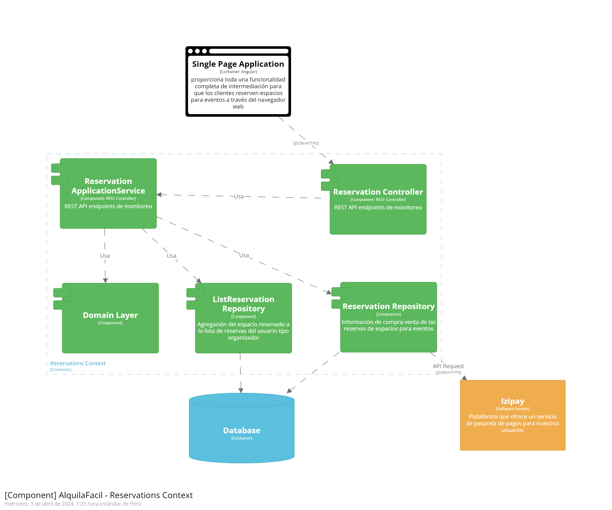

# Capítulo IV: Product Design
## 4.1. Style Guidelines.
### 4.1.1. General Style Guidelines

**Overview:** <td>Deseamos capturar la atención del usuario desde el inicio mediante la creación y el diseño de una perspectiva del producto que establezca una conexión inmediata y reconocible.</td>

**Brand Name:** <td>Como la startup se trata de alquilar centros para eventos y también para publicitar centros que podrían ser alquilados, se vio conveniente llamarlo “AlquilaFacil”.</td>

**Typography:** <td>Las tipografías asignadas por el equipo fueron:</td>

**Colors:** <td></td>

**Botton:** <td></td>
### 4.1.2. Web Style Guidelines
<td>AlquilaFacil se diseñará como plataforma web, por lo tanto, aplicaremos un diseño adaptable (Web Responsive Design) con el objetivo de presentar la información de manera óptima en cualquier dispositivo, asegurando que el contenido permanezca intacto para mejorar la experiencia del usuario.</td>
  
<td>Además, como equipo, hemos elegido implementar el patrón de diseño en forma de Z en el sitio web. Esta técnica de diseño web resulta efectiva para mejorar la experiencia del usuario al dirigir su atención hacia los elementos clave y potenciar la eficacia del contenido en la página. Por lo general, colocamos el logotipo en la esquina superior izquierda para que sea lo primero que capte la atención del usuario. Justo en frente, en la esquina superior derecha, ubicamos la barra de navegación, acompañado de un llamado a la acción que se destaca.</td>

## 4.2. Information Architecture
Esta sección se basa principalmente del contenido visual, los estilos, los tags y más que se tomarán en cuenta para nuestra web y landing page de AquilaFacil. Se verá los tópicos de Organization Systems, Labeling Systemes, SEO and Meta Tags y Searching y Navigation Systems.
### 4.2.1. Organization Systems
### 4.2.2. Labeling Systems
### 4.2.3. SEO Tags and Meta Tags
### 4.2.4. Searching Systems
### 4.2.5. Navigation Systems
## 4.3. Landing Page UI Design
### 4.3.1. Landing Page Wireframe
### 4.3.2. Landing Page Mock-up
## 4.4. Web Applications UX/UI Design
### 4.4.1. Web Applications Wireframes
### 4.4.2. Web Applications Wireflow Diagrams
### 4.4.3. Web Applications Mock-ups
### 4.4.4. Web Applications User Flow Diagrams
## 4.5. Web Applications Prototyping
## 4.6. Domain-Driven Software Architecture
A continuación, se visualizarán los diagramas C4.
### 4.6.1. Software Architecture Context Diagram
Se puede visualizar el diagrama de contexto que representa un panorama general de la comunicación entre nuestros segmentos objetivo y la aplicación.

### 4.6.2. Software Architecture Container Diagrams
En este diagrama se puede apreciar el funcionamiento que tendrá la aplicación y las relaciones con los bounded context correspondientes, se busca organizarlos de tal forma que no generen dependencias fuertes que perjudiquen migraciones a future.

### 4.6.3. Software Architecture Components Diagrams
En este diagrama se presenta de forma detallada las conexiones entre controllers, services y repositories de las entidades que contiene el bounded context.

<strong>User Context</strong>

<strong>Suscription Context</strong>

<strong>Space Context</strong>

<strong>CreateReservation Context</strong>

<strong>Reservations Context</strong>

## 4.7. Software Object-Oriented Design
### 4.7.1. Class Diagrams
### 4.7.2. Class Dictionary
## 4.8. Database Design
### 4.8.1. Database Diagram