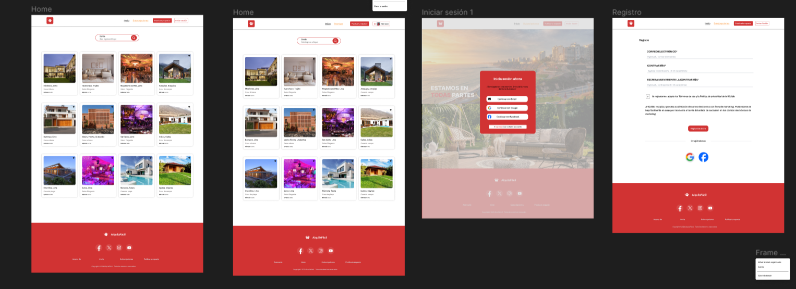
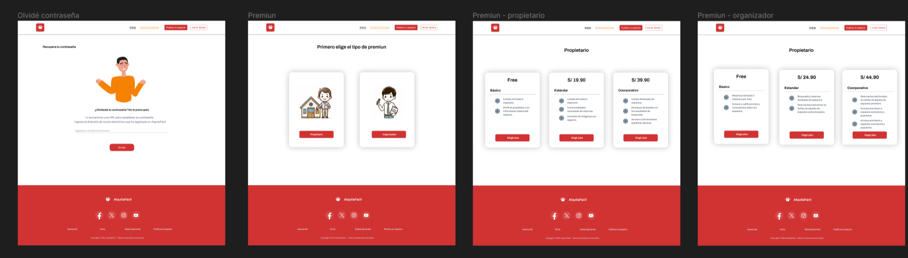
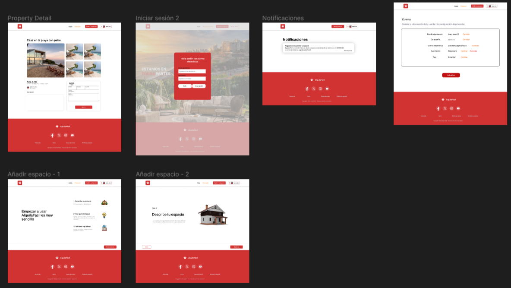
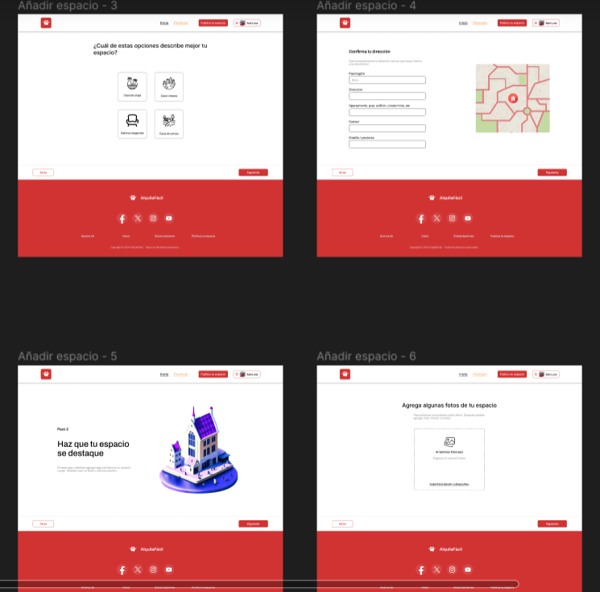
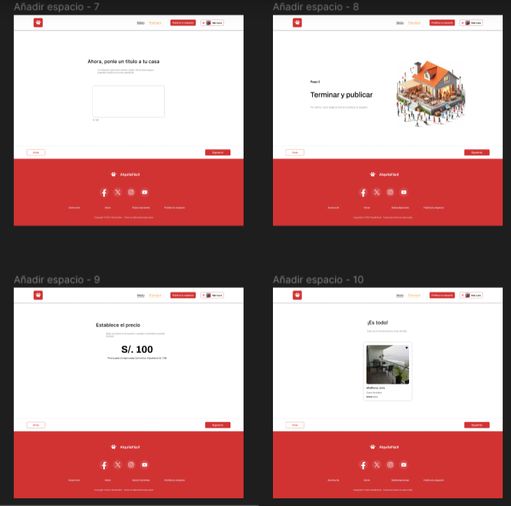
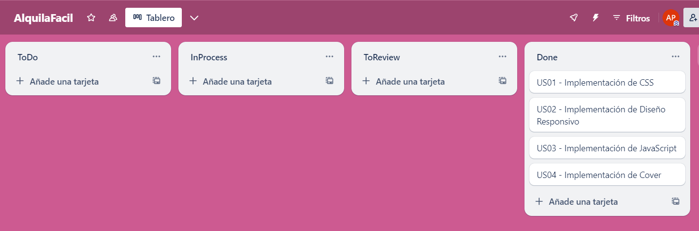
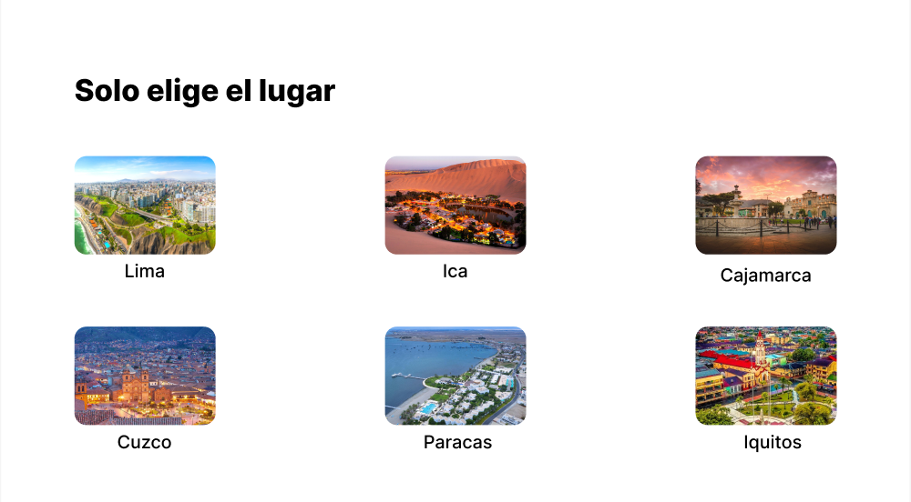
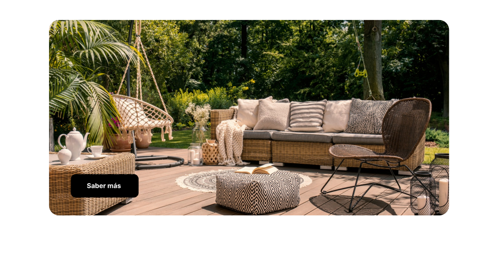
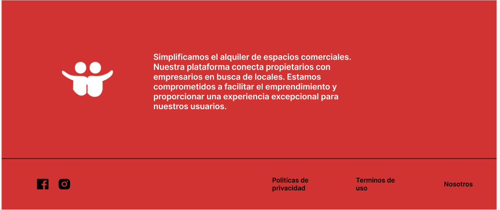
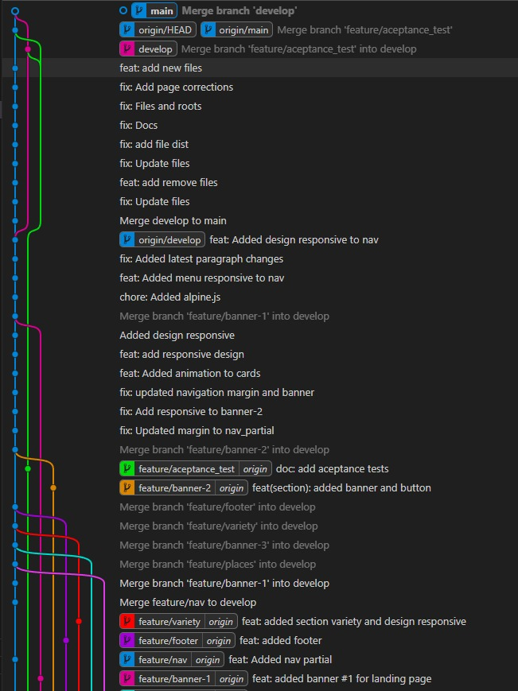

# COURSE PROJECT

    <strong>Universidad Peruana de Ciencias Aplicadas</strong> 
    </img> 
    <strong>Ingeniería de Software</strong> 
    <strong>Aplicaciones Web - SW56</strong> 
    <strong>Profesor: Efraín Ricardo Bautista Ubillús</strong> 
     INFORME

    <strong>Startup:  </strong> 
    <strong>Producto: AlquilaFácil </strong>

    <h3 align="center">Team Members:</h3>
    

     <table align="center">
        <tr>
            <th style="text-align:center;">Member</th>
            <th style="text-align:center;">Code</th>
        </tr>
        <tr>
            <td>Luna Capuñay, Italo D'Alessandro</td>
            <td>U202213375</td>
        </tr>
        <tr>
            <td></td>
            <td></td>
        </tr>
        <tr>
            <td></td>
            <td></td>
        </tr>
        <tr>
            <td></td>
            <td></td>
        </tr>
         <tr>
            <td></td>
            <td></td>
        </tr>
          <tr>
            <td>Gamio Upiachihua, Brenda Lucía</td>
            <td>U202120344</td>
        </tr>
    </table>

    <strong>Marzo 2024</strong>

 

---

# Registro de Versiones del Informe
| Versión  | Fecha  | Autor  | Descripción de la modificación  |
| ------------ | ------------ | ------------ | ------------ |
| TB1  |   | Todos los integrantes del equipo  | .  |

 

---

# Project Report Collaboration Insights

TB1:

# Student Outcome

# Capítulo I: Introducción
## 1.1. StartUp Profile
En esta sección describiremos el perfil de nuestra Startup.
### 1.1.1. Description de la StartUp
Alquilafacil es un startup tecnológico fundada en el 2024 por un grupo de estudiantes compuesta por un grupo de estudiantes de la carrera de Ingeniería de Software. Nuestro startup está dedicada a simplificar el proceso de alquiler de espacios para eventos, brindando una plataforma innovadora y accesible para propietarios y organizadores por igual.
* **Misión:**
Nuestra misión es simplificar el proceso de alquiler de espacios para eventos mediante una plataforma intuitiva y eficiente, conectando a propietarios de espacios con organizadores de manera rápiad y conveniente.
* **Visión:**
Convertirnos en la principal plataforma global de alquiler de espacios para eventos, impulsando la eficiencia y la satisfacción de nuestros usuarios.
### 1.1.2. Perfiles de integrantes del equipo
<table style="text-aling:center">
    <thead>
        <tr>
            <th>Integrantes</th>
            <th>Descripcion</th>
            <th>Conocimientos</th>
        </tr>
    </thead>
    <body>
        <tr>
            <!-- DATOS del integrante 1-->
            <td> 
            
             Josten Marc Huaman Bellido
            </td>
            <!-- DESCRIPCIÓN del integrante 1-->
            <td>Estudiante de la carrera de Ingeniería de Software, cursando el 5to ciclo. Soy una persona responsable, autodidacta. Me gusta trabajar en equipo, aportar ideas y adquirir nuevos conocimientos de parte de mis compañeros. </td>
            <!-- CONOCIMIENTOS del integrante 1-->
            <td>Conocimiento de Front en lenguaje HTML, CSS, JavaScript. Conocimiento básico de C++, python, base de datos. Habilidades en programas de diseño web. </td>
        </tr>
        <tr>
            <!-- DATOS del integrante 2-->
            <td> 
            
            Italo D'Alessandro Luna Capuñay
            </td>
            <td> Soy un estudiante apasionado de ingeniería de software. Mi meta es seguir aprendiendo y mejorando constantemente en esta área en constante evolución. Soy responsable, creativo y adaptable, disfruto trabajando en equipo y colaborando eficazmente. Fuera del mundo de la programación, disfruto jugando al fútbol y pasando tiempo con amigos, valorando enormemente su apoyo e inspiración.</td>
            <td>
            Conocimiento en C++
            Flutter
            Tailwind
            HTML
            CSS
            </td>
        </tr>
        <tr>
            <!-- DATOS del integrante 3-->
            <td> 
            
            Augusto Jose Pin Matallana
            </td>
            <td>Tengo 18 y estudio en la carrera de ingeniería de software, me gusta todo lo que tiene que ver con computación y desarrollo de aplicaciones o videojuegos, actualmente estoy en el quinto ciclo y hasta ahora me ha gustado todo lo que tiene la carrera. Dejando la carrera a un lado me gusta salir con mis amigos a comer a pasar tiempo de calidad entre nosotros.
            </td>
            <!-- CONOCIMIENTOS del integrante 3-->
            <td>
            Conocimiento en C#
            C++
            Javascript
            ASP.NET MVC
            SQL / NoSQL
            </td>
        </tr>
        <td> 
            
            Angel Antonio Cancho Corilla
            </td>
            <td> 
            Soy un estudiante comprometido y dedicado, siempre dispuesto a aprender y a investigar para mejorar mi desempeño en el trabajo. Me gusta mantenerme actualizada y explorar nuevas formas de facilitar las tareas y alcanzar los objetivos de manera más eficiente.</td>
            <td> Conocimientos básicos en Python, Java, y C++, así como en varios frameworks asociados a estos lenguajes de programación.</td>
        </tr>
        <tr>
            <!-- DATOS del integrante 5-->
            <td>
            
             Brenda Lucía Gamio Upiachihua
            </td>
            <!-- DESCRIPCIÓN del integrante 5-->
            <td>Estudiante del 5to ciclo de la carrera de Ingeniería de Software. Soy alguien responsable y dedicada que le gusta aprendere e investigar más cosas para facilitar el trabajo. </td>
            <!-- CONOCIMIENTOS del integrante 5-->
            <td>Conocimientos en HTML, CSS, JavaScript, C++, Python y base de datos SQL y No SQL.  </td>
        </tr>
    </body>
</table>

## 1.2. Solution Profile

En esta sección se detallan los aspectos claves de nuestra solución de software, incluyendo sus carcateristicas distintivas, propuestas de valor y estrategias de monetización.

**Product Name:**
AlquilaFácil

**Product Description:**
AlquilaFácil es una solución tecnológica diseñada para simplificar el proceso de alquiler de espacios para eventos al conectar de manera eficiente a propietarios de espacios con organizadores. La plataforma permite buscar, reservar y gestionar espacios para una variedad de eventos, ofreciendo una una experiencia fluida y sin problemas. Además, proporciona herramientas de seguimiento en tiempo real y gestión de reservas para garantizar una experiencia óptima.

**Monetización:**
Para generar ingresos,AlquilaFácil implementará un modelo de planes para propietarios de espacios que deseen destacas sus listados y acceder a funciones avanzadas de gestión de reservas. Estos planes ofrecerán beneficios adicionales, como destacar en los listados de resultados de búsqueda y acceso prioritario a herramientas analíticas. Por otro lado, el acceso a la plataforma para organizadores de evento será gratuito, lo que fomentará su participación y aumentará la oferta de espacio disponible. 

### 1.2.1. Antecedentes y problemática

### Antecedentes

En la actualidad las personas poseen un fácil acceso a diferentes herramientas tecnológicas para reservar y alquilar diferentes locales de eventos, tanto en página webs o a través de un aplicativo movil. Esto genera una mayor demanda en nuestro país sobre el creciente mercado de las reservas online. Además, con el incremento de usuarios que tienen acceso a internet, uso de dispositivos para facilitar el proceso de reserva espacios para eventos.

La INEI muestra estadísticas de aumento en la personas que accedió a internet entre 2019 hasta 2022.

    "En los primeros tres meses del 2022, 73 de cada 100 personas de 6 y más años de edad accedieron a Internet en el país, cifra que muestra un crecimiento de 5,1 y 17,7 puntos porcentuales al compararla con igual trimestre de los años 2021 (67,4%) y 2019 (54,8%), respectivamente." (INEI, 2022)

Esto señala que el Perú existe un gran incremento en el uso de internet, lo que podrá ser una ventaja para personas que deseen realizar una reserva de espacios para eventos pero un medio tecnológico.

### Problemáticas

#### Técnica de las 5 'W's y 2 'H's

#### What?

**¿Cuál es el problema?**

El problema es la falta de una plataforma centralizada y eficiente para el alquiler de espacios para eventos. Actualmente, propietarios de espacios y organizadores de eventos enfrentan dificultades al buscar y reservar espacios adecuados para sus necesidades.

**¿Cuál es la relación con la persona en cuestión?**

La persona en cuestión es que si es propietario de un espacio para eventos, puede enfrentar dificultades al encontrar y atraer a potenciales clientes para alquilar su espacio. Del mismo modo, si una organizadores de eventos, puede enfrentar desafios al buscar y reservar un espacio adecuado para sus eventos.

### When?

**¿Cuánto sucede el problema?**

El problema ocurre cada vez que propietarios de espacios desean alquilar sus instalaciones para eventos o organizadores de eventos buscan espacios para celebrar sus actividades. Esta necesidades surge de manera recurrente y en diferentes momentos, ya sea para eventos planificados con anticipación o para aquellos que requieran una búsqueda rápida de un espacio disponible.

**¿Cuándo utiliza el cliente el producto?**

Cuando organizaciones o personas necesitan encontrar y reservar un espacio para un evento, ya sea con anticipación o de manera urgente. También, para aquellas personas que poseen instalaciones para realizar eventos y deseen promocionar su espacio, conectándose así con clientes potenciales.

### Where?

**¿Donde está el cliente cuando usa el producto?**

El cliente utiliza AlquilaFácil principalmente en linea, a través de la plataforma web.

**¿A donde se dirige?**

Se dirige a una plataforma en línea, donde puede buscar, comparar y reservar espacos para eventos de manera conveniente y eficiente.

**¿Dónde surge el problema?**

El problema surge en la dificultad para encontrar y reservar espacios adecuados para eventos, ya sea durante la planificación anticipada de un evento o en situaciones donde se requiere una búsqueda rápida. 

### Why?

**¿Cuál es la causa del problema?**

La falta de una plataforma centralizada y eficiente que conecte a propietarios de espacios con personas que buscan alquilar un espacio para eventos. La ausencia de un sistema unificado dificulta la búsqueda y reserva de espacios adecuados, lo que puede generar frustación y pérdida de oportunidades tanto para propietarios como para organizadores. 

### How? 

**¿En que condiciones los clientes usan nuestro productos?**

Los clientes utilizan AlquilaFácil para buscar y reservar espacios para una variedad de eventos, ya sea para eventos sociales o corporativos. 

**¿Cómo prefieren los clientes acceder a nuestro producto?**

Los clientes prefieren acceder a nuestro producto, a través de una plataforma web.

**¿Que llevó al cliente a llegar a esta situación?**

La falta de una plataforma para el alquiler de espacios eventos llevó tanto a los clientes que buscan espacios como a los propietarios de espacios a esta situación. 

### How much?

Los costos de AlquilFácil varían segun el plan de suscripcion seleccionada. Ofrecemos opciones gratuitas para los usuarios básicos, así como planes de suscripción mensual o anual con tarifas moderadas para aquellos que deseen optar por un plan premium y beneficios adicionales.

### 1.2.2. Lean UX Process

En esta sección se realizará el proceso de Lean UX en donde se abarca la visión del modelo de negocio que será soportado por nuestro producto de software. Gracias a este enfoque metodológico, podemos dirigir nuestra atención hacia el diseño de nuestro solución y los problemas identificados mediante el pensamiento de diseño.

#### 1.2.2.1. Lean UX Problem Statements

A continuación, empleamos la plantilla de Business Opportunity Statements (Gothelf,2022) para orientar a nuestro equipo de trabajo en la creación de un servicio sin restricciones que puedan limitar la creatividad y la agilidad. Este enfoque nos impulsa a pensar en nuestro trabajo en  términos que respondan a las necesidades de los clientes y nos prepara para un lanzamiento exitoso de nuestra idea. 

- La plantilla de Businees Opportunity Statement:

El estado actual de **[domain]** se ha centrado principalmente en **[segments, pain points, etc.]**

Lo que los productos/servicios existentes no logran abordar es **[this gap]**. 
 
Nuestro producto/servicio abordará esta brecha mediante **[vision / strategy]**. 
 
Nuestro enfoque inicial será **[this segment]**. 
 
Sabremos que tenemos éxito cuando veamos **[these behaviors in our target audience]**. 

- AlquilaFácil Lean UX Problem Statements: 

El estado actual de **nuestro servicio de plataforma web para el alquiler de espacios para eventos** se ha centrado principalmente en **proporcionar una amplia variedad de espacios y opciones para propietarios y organizadores de eventos, permitiéndoles crear,gestionar y realizar un seguimiento en tiempo real de sus reservas.**

Sin embargo, los productos/servicios existentes no logran abordar **completamente la conexión con potenciales clientes y, al mismo tiempo, ofrecer herramientas que acompañen a los propietarios de espacios y organizadores durante el proceso de alquiler.**

Nuestro producto/servicio abordará esta brecha mediante **el desarrollo e implementación de una plataforma web optimizada, ya que puede adaptarse fácilmente para satisfacer las necesidades específicas de los usuarios. Nuestro equipo de programadores se encargará de garantizar soluciones tecnológicas eficientes y flexibles.**

Nuestro enfoque inicial será **captar el mercado de alquiler de espacios para eventos en Perú.**

Sabremos que tenemos éxito cuando veamos **el cumplimiento de nuestras metas de suscripciones y alcance de clientes dentro de los primeros años desde el lanzamiento de nuestro servicio.**

#### 1.2.2.2. Lean UX Assumptions

- Users: 

Personas que buscan alquilara para eventos en Perú.

Empresas y propietarios de espacios que desean promocionara sus locales y gestionar sus reservas de manera eficiente.

Organizadores de eventos que necesitan encontrar y reservar espacios para sus actividades dentro del territorio peruano. 

- User Outcomes: 

Segmento contratista:

Acceder a una plataforma en línea que facilite la comunicación con múltiples propietarios de espacios para eventos en Perú.

Buscar y filtrar opciones de espacios disponibles utilizando criterios específicos y palabras clave.

Verificar las clasificaciones y el historial de los espacios para tomar decisiones informadas sobre qué espacios promocionar y reservar.

Segmento de propietarios de espacios: 

Promocionar sus espacios a una audiencia más amplia de organizadores de eventos.

Gestionar todas las reservas y comunicaciones con los clientes desde una sola plataforma. 

Mantener a los organizadores de eventos informados sobre el estado de sus reservas y cualquier detalle relevante sobre los espacios.

- Suposiciones de negocios: 

Creemos que existe una demanda creciente en el mercado de alquiler de espacios para eventos. Observamos que numeros organizadores de eventos buscan opciones versátiles y atractivas para celebrar sus actividades, lo que representaría una gran oportunidad para nuestra plataforma. 

Aunque reconocemos la competencia en el sector de alquiler de espacios, estamos seguros de que podemos destacarnos ofreciendo una plataforma en línea que simplique y mejore la experiencia tanto para los propietarios de espacios como para los organizadores de eventos.

Creemos que los usuarios tienen la capacidad técnica y la disposición para utilizar una plataforma en línea para buscar y reservar espacios para eventos. Nuestro objetivo es hacer que la experiencia sea lo más sencilla y conveniente posible para todos los usuarios.

Estamos convecidos de que los clientes valorarán la conveniencia, transparencia y calidad del servicio que ofrecerá nuestra plataforma de alquiler de espacios para eventos. 

- Suposiciones de usuarios:

¿Quién utiliza nuestra plataforma? Nuestra plataforma es utilizada para propietarios de espacios que desean alquiler sus instalaciones para eventos, asi como organizadores de eventos interesados en encontrar y reservar espacios adecuados para sus actividades.

¿Cómo se integra nuestro producto en la rutina laboral o cotidiana? Nuestro producto se integra en la rutina laboral o cotidiana al proporcionar una solución conveniente y centralizada para buscar,reservar y gestionar espacios para eventos. Tanto para los propietarios de espacios como para los organizadores de eventos, AlquilaFácil simplifica el proceso, permitiéndoles acceder a servicios desde cualquier lugar y en cualquier momento.

¿Cuáles son los desafios de aborda nuestro producto? AlquilaFácil aborda los desafíos asociados con la búsqueda y reserva de espacios para eventos, como la dificultad para encontrar espacios adecuados, la falta de transpariencia en los procesos de reserva y la gestión manual de reservas. También ofrece soluciones para los propietarios de espacios al proporcionalres una plataforma para promocionar sus espacios y gestionar sus reservas de manera eficiente.

¿Cuál es la imagen que deseamos proyectar con nuestro producto? 
Deseamos proyectar una imagen de confianza, transparencia, innovación y accesibilidad. Queremos que AlquilaFácil sea vista como la solución lider en la industria de alquiler de espacios para eventos.

¿Cuál es el propósito fundamental de nuestra aplicación?
El propósito fundamental de AlquilaFácil es facilitar el proceso de búsqueda, reserva y gestión de espacios para eventos para propietarios de espacios y organizadores de eventos.

¿qué funcionalidades destacan en nuestra aplicación? 
Las funcionalidades destacadas de AlquilaFácil incluyen la búsqueda avanzada de espacios espacios basada en ubicación y características, la gestión de reservas en línea que permite a los usuarios monitorear el estado de sus reservas y comunicarse con los propietarios de espacios, un sistema de calificaciones y comentarios para garantizar la calidad de los espacios, y herramineots de promoción y análisis para propietarios de espacios.

#### 1.2.2.3. Lean UX Hypothesis Statements

Para la elaboración de los Hypothesis Statements se utilizó el formato Lean UX: **[We believe that]**,**[This will achieve]** y **[We will have demostrated this when]** 

- Hipotesis 1

**Creemos que** si simplificamos el proceso de búsqueda y comparación de espacios para eventos en nuestra plataforma, entonces **esto logrará** aumentar significativamente la cantidad de clientes recurrentes, proyectando un aumento del 25% en la tasa de clientes que regresa dentro de los primero seis meses de implementación de esta mejora.

**Sabremos que** estamos en lo cierto.

**Cuando** observemos que un aumento del 25% en la cantidad de reservas realizadas por los clientes visitantes en nuestra plataforma durante el mismo periodo.

- Hipotesis 2

**Creemos que** si implementamos un sistema de calificación y comentarios para los espacios disponibles en nuestra plataforma, entonces **esto logrará** aumentar la confianza de los usuarios y mejorar la calidad percibida de los espacios, lo que resultará en un aumento del 15% en el número de reservas realizadas en los primeros tres meses después de la implementación.

**Sabremos que** estamos en lo cierto.

**Cuando** observemos un aumento del 20% en la cantidad de reservas completadas y una mejora en las calificaciones y comentarios proporcionados por los usuarios.

- Hipotesis 3

**Creemos que** si ofrecemos descuentos exclusivos en tarifas de alquiler de espacios seleccionados para los usuarios con suscripción premium, entonces **esto logrará** aumentar la conversión de usuarios de planes básicos a planes premium, proyectando un aumento del 25% en la cantidad de usuarios premium dentro de los primeros seis meses de implementación de esta estrategia.

**Sabremos que** estamos en lo cierto.

**Cuando** observemos un aumento del 30% en la cantidad de usuarios que actualizan su suscripción a premium y una mejora en el volumen de reservas por estos usuarios.

- Hipotesis 4

**Creemos que** si mejoramos la función búsqueda avanzada en nuestra plataforma, permitiendo a los usuarios filtrar por caracteristicas específicas de los espacios (como capacidad, ubicación y servicios incluidos), entonces **esto logrará** aumentar la satisfacción del usuario y la precisión en la selección de espacios, proyectando una reducción del 20% en las consultas de soporte relacionadas con la búsqueda de espacios.

**Sabremos que** estamos en lo cierto.

**Cuando** observemos una disminución del 25% en el número de consultas de soporte recibidas y un aumento en el tiempo promedio que los usuarios pasan en la plataforma buscando espacios.

- Hipotesis 5

**Creemos que** si implementamos un programa de referidos que recompense a los usuarios que refieran nuevos propietarios de espacios o organizadores de eventos a nuestra plataforma, entonces **esto logrará** aumentar la adquisión de usuarios y el crecimiento orgánico de nuestra base de clientes, proyectando un aumento del 30% en el número de nuevos registros dentro de los primeros tres meses de implementación del programa.

**Sabremos que** estamos en lo cierto.

**Cuando** observemos un aumento del 35% en la cantidad de registros de nuevos usuarios y un aumento en el número de referidos realizados por los usuarios existentes.
#### 1.2.2.4. Lean UX Canvas

<em> Fuente: Elaboración propia. </em>

# 1.3. Segmentos Objetivo

En esta sección, identificamos los segmentos de clientes específicos a los que se dirige AlquilaFácil, basándonos en características demográficas, comportamientos y necesidades compartidas.

- Organizadores de Eventos Sociales/ Usuarios Frecuentes de Espacios para Eventos: 

Descripción: Individuos que planifican eventos sociales como bodas, fiestas de cumpleaños, reuniones familiares, entre otros e individuos que organizan eventos regularmente, ya sea social o corporativo.

Características: Buscan espacios que se adapten a sus necesidades específicas, como capacidad, ubicación y servicios disponibles y realizan múltiples reservas de espacios a lo largo del año.

Necesidades: Facilidad de búsqueda y reserva de espacios, acceso a información detallada sobre las instalaciones y servicios ofrecidos y programas de fidelización, descuentos por reservas recurrentes, acceso prioritario a espacios exclusivos.

- Propietarios de Espacios para Eventos: 

Descripción: Individuos o empresas que poseen espacios aptos para eventos, como salones de banquetes, jardines, locales comerciales, etc.

Características: Ofrecen una variedad de espacios con diferentes capacidades y características.

Necesidades: Promoción efectiva de sus espacios, gestión eficiente de reservas, acceso a herramientas para administrar sus listados y proyectos de eventos.
# Capítulo II: Requirements Elicitation & Analysis
## 2.1. Competidores
Después de realizar una investigación de mercado, hemos identificado tres plataformas que ofrecen características similares a las de nuestra aplicación para conectar propietarios de espacios con organizadores de eventos. Estas son:
1. **Airbnb:**
Es una plataforma en línea fundada en 2008 que revolucionó la industria hotelera al ofrecer una alternativa a los hoteles tradicionales. Permite a los usuarios alquilar alojamientos a corto plazo, desde habitaciones individuales hasta casas completas, en más de 191 países. Facilita la conexión entre anfitriones que desean alquilar sus propiedades y huéspedes en busca de alojamiento temporal.

                

2. **Vrbo:**
Es una plataforma en línea fundada en 1995 que facilita el alquiler de alojamientos vacacionales directamente a través de los propietarios. El nombre significa "Vacation Rentals by Owner" (Alquileres Vacacionales por Propietario). Es uno de los principales sitios web para alquileres vacacionales en todo el mundo, donde los usuarios pueden buscar y reservar casas, apartamentos, cabañas y villas en una variedad de destinos. Esto les permite encontrar opciones que se adapten a sus necesidades y preferencias.

                

3. **Booking:**
Es una plataforma que permite a los usuarios reservar alojamiento en hoteles, hostales, apartamentos y otros tipos de alojamiento en todo el mundo. También ofrece la posibilidad de reservar vuelos, alquilar coches y reservar actividades turísticas. Booking.com es una de las mayores plataformas de reserva de alojamiento en línea y ofrece una amplia variedad de opciones para viajeros de todo tipo. Los usuarios pueden buscar alojamientos según sus preferencias y presupuesto, y realizar reservas de manera rápida y conveniente a través de la plataforma.

                

### 2.1.1. Análisis competitivo
<table>
  <tr>
    <th colspan="7" valign="top"><b>Competitive Analysis Landscape</b></th>
  </tr>
  <tr>
    <td colspan="2" rowspan="2">¿Por qué llevar a cabo este análisis?</td>
    <td colspan="5">Escriba en el recuadro la pregunta que busca responder o el objetivo de este análisis.</td>
  </tr>
  <tr>
    <td colspan="5">Este análisis se realizó con la finalidad de poder identificar a nuestros potenciales competidores e idear estrategias y tácticas para diferenciarnos de estos.</td>
  </tr>
  <tr>
    <td colspan="3">(En la cabecera colocar por cada competidor nombre y logo)</td>
    <td colspan="1" valign="top" style="font-weight: bold;">
        AlquilaFácil
         
        

                
        

    <td colspan="1" valign="top" style="font-weight: bold;">
      Airbnb
        

                
        

    </td>
    <td colspan="1" valign="top" style="font-weight: bold;">
      Vrbo
        

                
            

        </td>
    <td colspan="1" valign="top" style="font-weight: bold;" >
      Booking
        

                
        

    </td>
  </tr>
  <tr>
    <td colspan="1" rowspan="2">
Perfil
</td>
    <td colspan="2">Overview</td>
    <td colspan="1" valign="top">Es una plataforma en línea que facilita el alquiler de una amplia gama de espacios para eventos, desde salones de eventos hasta casas y alojamientos temporales. Con una interfaz fácil de usar, conecta a propietarios con organizadores, ofreciendo una solución conveniente y eficiente para satisfacer las necesidades de ambos.</td>
    <td colspan="1" valign="top">Plataforma en línea que revoluciona el alquiler de alojamientos a corto plazo, conectando anfitriones y huéspedes en todo el mundo. Ofrece una amplia variedad de opciones de alojamiento, desde habitaciones individuales hasta casas completas.</td>
    <td colspan="1" valign="top">Plataforma en línea que permite a los usuarios buscar y reservar alojamientos vacacionales directamente a través de propietarios. Ofrece una variedad de opciones de alojamiento, como casas, apartamentos, cabañas y villas, en diferentes destinos, adaptándose a las necesidades y preferencias de los viajeros.</td>
    <td colspan="1" valign="top">Booking.com es una plataforma líder para reservar alojamiento y actividades turísticas en todo el mundo. Ofrece una amplia variedad de opciones, desde hoteles hasta apartamentos, y facilita la búsqueda y reserva según las preferencias y presupuesto de los usuarios.</td>
  </tr>
  <tr>
    <td colspan="2">Ventaja competitiva</td>
    <td colspan="1" valign="top">Proporciona una solución completa para la planificación de eventos, ofreciendo una amplia gama de espacios para eventos y una plataforma intuitiva para gestionar reservas. Con características como registro gratuito de espacios, búsqueda avanzada y servicio al cliente dedicado, Alquila Fácil simplifica el proceso de planificación de eventos para organizadores y propietarios de espacios.</td>
    <td colspan="1" valign="top">Ofrece una amplia variedad de alojamientos en todo el mundo, desde habitaciones individuales hasta casas completas, junto con experiencias locales únicas organizadas por anfitriones. Esto permite a los viajeros personalizar su experiencia y sumergirse en la cultura local.</td>
    <td colspan="1" valign="top">Se especializa en alquileres vacacionales directamente a través de propietarios, brindando a los viajeros la oportunidad de disfrutar de una experiencia más auténtica y personalizada. Con una amplia selección de alojamientos vacacionales, Vrbo ofrece opciones para todos los gustos y presupuestos.</td>
    <td colspan="1" valign="top">Destaca por su amplia oferta de alojamiento y servicios, que incluyen hoteles, vuelos, alquiler de coches y actividades turísticas. La plataforma fácil de usar permite a los usuarios encontrar y reservar alojamiento de manera rápida y sencilla, ofreciendo una solución integral para los viajeros.</td>
  </tr>
  <tr>
    <td colspan="1" rowspan="2">
Perfil de Marketing
</td>
    <td colspan="2">Mercado objetivo</td>
    <td colspan="1" valign="top">Dirigido a organizadores de eventos adultos de 18 años en adelante que buscan espacios para eventos sociales, corporativos o especiales, como bodas, conferencias, fiestas de empresa, entre otros. Además, atrae a empresas y organizaciones que buscan espacios para eventos corporativos y reuniones profesionales dirigidas a un público adulto.</td>
    <td colspan="1" valign="top">Se centra en viajeros adultos de 18 años en adelante, ofreciendo una amplia variedad de alojamientos en todo el mundo, desde habitaciones individuales hasta casas completas, para adaptarse a diferentes necesidades y preferencias de viaje. Además, apunta a grupos de amigos, parejas y familias adultas que buscan opciones de alojamiento que se ajusten a sus requerimientos y presupuestos durante sus vacaciones o escapadas.</td>
    <td colspan="1" valign="top">Está dirigido a familias y grupos de amigos adultos de 18 años en adelante que buscan alquilar casas, villas o cabañas para vacaciones o escapadas grupales. Además, atrae a parejas y grupos de amigos adultos que buscan alquilar alojamientos vacacionales para eventos especiales, como bodas, reuniones familiares o celebraciones de cumpleaños.</td>
    <td colspan="1" valign="top">Orientado a viajeros adultos de 18 años en adelante, busca ofrecer una amplia gama de opciones de alojamiento para adaptarse a diversas necesidades y preferencias durante sus viajes. También se dirige a personas que viajan por negocios, parejas en escapadas románticas, grupos de amigos en vacaciones y familias en busca de opciones de alojamiento cómodas y convenientes.</td>
  </tr>
  <tr>
    <td colspan="2">Estrategias de marketing</td>
    <td colspan="1" valign="top">Alquila Fácil destaca con marketing de contenidos, participación en eventos de la industria y alianzas con proveedores de servicios de eventos para ofrecer soluciones completas a organizadores de eventos.</td>
    <td colspan="1" valign="top">Airbnb emplea campañas publicitarias en redes sociales y colaboraciones con influencers para promocionar destinos y experiencias únicas. También utiliza programas de referidos para aumentar su base de usuarios.</td>
    <td colspan="1" valign="top">Vrbo se centra en contenido educativo en su sitio web, colaboraciones con agencias de viajes y ofertas exclusivas para atraer a familias y grupos de amigos a reservar a través de su plataforma.</td>
    <td colspan="1" valign="top">Booking.com utiliza estrategias de SEO y SEM, junto con programas de fidelización, para atraer tráfico y fomentar la lealtad del cliente a través de una experiencia personalizada.</td>
  </tr>
  <tr>
    <td colspan="1" rowspan="3">
Perfil de Producto
</td>
    <td colspan="2">Productos & Servicios</td>
    <td colspan="1" valign="top">Aplicación web que conecta a propietarios de diversos espacios, como salones de eventos, jardines y locales comerciales, con organizadores de eventos que buscan alquilar estos espacios para celebrar eventos sociales, corporativos o especiales. Proporciona una variedad de herramientas y servicios para facilitar la búsqueda, reserva y gestión de espacios para eventos.</td>
    <td colspan="1" valign="top">Plataforma en línea donde los usuarios pueden alquilar una variedad de alojamientos a corto plazo, desde habitaciones individuales hasta casas completas, en todo el mundo. Además de alojamiento, Airbnb también proporciona experiencias locales únicas organizadas por anfitriones, como recorridos gastronómicos, clases de cocina y excursiones.</td>
    <td colspan="1" valign="top">Plataforma para alquilar alojamientos vacacionales directamente a través de los propietarios. Los usuarios pueden encontrar y reservar una amplia gama de propiedades, que van desde casas y apartamentos hasta cabañas y villas, para sus vacaciones o escapadas en todo el mundo.</td>
    <td colspan="1" valign="top">Plataforma en línea que permite a los usuarios reservar una variedad de alojamientos, incluyendo hoteles, hostales, apartamentos y otros tipos de hospedaje en todo el mundo. Además de alojamiento, Booking.com ofrece la posibilidad de reservar vuelos, alquilar coches y reservar actividades turísticas para completar la experiencia de viaje del usuario.</td>
  </tr>
  <tr>
      <td colspan="2">Precios & Costos</td>
      <td colspan="1" valign="top">Los precios de AlquilaFácil varían dependiendo del lugar, el tamaño de la propiedad, servicios, y el tiempo de uso.</td>
      <td colspan="1" valign="top">El costo promedio puede variar significativamente dependiendo de varios factores, como la ubicación, el tipo de alojamiento, la época del año y la demanda local.</td>
      <td colspan="1" valign="top">Los precios en VRBO pueden variar significativamente dependiendo de la ubicación, el tamaño de la propiedad, las comodidades ofrecidas y la temporada del año.</td>
      <td colspan="1" valign="top">Los precios pueden variar significativamente según la ubicación, la temporada, la demanda y el tipo de alojamiento.</td>
  </tr>
  <tr>
    <td colspan="2">Canales de distribución (Web y/o Móvil)</td>
    <td colspan="1" valign="top">Redes sociales y aplicación web donde los usuarios pueden poner en renta su espacio o alquilar un espacio para eventos.</td>
    <td colspan="1" valign="top">Sitio web de Airbnb, aplicación móvil de Airbnb, socios afiliados y asociaciones, redes sociales y marketing digital.</td>
    <td colspan="1" valign="top">Principalmente su sitio web y su aplicación móvil, así como acuerdos de distribución con otros sitios web de viajes o agencias de viajes en línea.</td>
    <td colspan="1" valign="top">Sitio web de Booking.com, aplicación móvil de Booking, agencias de viajes en línea, alianzas con compañías de viajes, afiliados y asociados.</td>
  </tr>
  <tr>
    <td colspan="1" rowspan="5">
Análisis SWOT
</td>
    <td colspan="6">Realice esto para su startup y sus competidores. Sus fortalezas deberían apoyar sus oportunidades y contribuir a lo que ustedes definen como su posible ventaja competitiva.</td>
  </tr>
  <tr>
    <td colspan="2">Fortalezas</td>
    <td colspan="1" valign="top">Solución completa para la planificación de eventos.</td>
    <td colspan="1" valign="top">Gran comunidad de anfitriones y usuarios.</td>
    <td colspan="1" valign="top">Variedad de alojamientos en todo el mundo.</td>
    <td colspan="1" valign="top">Interfaz fácil de usar y experiencia intuitiva del usuario.</td>
  </tr>
  <tr>
    <td colspan="2">Debilidades</td>
    <td colspan="1" valign="top">Dependencia de la disponibilidad de espacios para eventos.</td>
    <td colspan="1" valign="top">Dependencia de la reputación y opiniones de los usuarios.</td>
    <td colspan="1" valign="top">Posible saturación del mercado de alquiler vacacional.</td>
    <td colspan="1" valign="top">Competencia intensa con otras plataformas de alquiler de alojamiento.</td>
  </tr>
  <tr>
    <td colspan="2">Oportunidades</td>
    <td colspan="1" valign="top">Expansión a nuevos mercados y nichos de eventos.</td>
    <td colspan="1" valign="top">Desarrollo de nuevas características y servicios para mejorar la experiencia del usuario.</td>
    <td colspan="1" valign="top">Alianzas estratégicas con proveedores de servicios de eventos.</td>
    <td colspan="1" valign="top">Aprovechamiento de la tendencia creciente del turismo y los viajes.</td>
  </tr>
  <tr>
    <td colspan="2">Amenazas</td>
    <td colspan="1" valign="top">Cambios en la regulación de alquileres vacacionales y eventos.</td>
    <td colspan="1" valign="top">Posible disminución de la demanda de viajes debido a crisis económicas o sanitarias.</td>
    <td colspan="1" valign="top">Innovaciones tecnológicas que podrían ser adoptadas por competidores.</td>
    <td colspan="1" valign="top">Posible pérdida de confianza del usuario debido a problemas de seguridad o calidad del servicio.</td>
  </tr>
</table>

### 2.1.2. Estrategias y tácticas frente a competidores

- **Diferenciación de la plataforma:** Identificaremos y destacaremos las características únicas de AlquilaFácil que la distinguen de otras plataformas de alquiler de espacios para eventos. Esto podría incluir herramientas innovadoras para la gestión de reservas, una interfaz fácil de usar que simplifica el proceso de búsqueda y reserva de espacios, y características adicionales como la personalización de eventos y la integración de servicios de catering o entretenimiento.

- **Comunidad activa:** Fomentaremos una comunidad activa de propietarios de espacios, organizadores de eventos y usuarios en la plataforma de AlquilaFácil. Ofreceremos espacios para que compartan sus experiencias, recomienden espacios y eventos, e interactúen entre sí. Esto no solo aumentará el compromiso de los usuarios, sino que también generará confianza y lealtad hacia la plataforma.

- **Marketing dirigido:** Utilizaremos estrategias de marketing digital dirigidas para llegar a nuestro público objetivo. Esto podría incluir publicidad en redes sociales dirigida a organizadores de eventos y propietarios de espacios, colaboraciones con organizadores de eventos locales e influencers en la industria de eventos, y la participación en ferias comerciales y eventos relevantes para promover la plataforma.

- **Monetización creativa:** Exploraremos diferentes modelos de monetización para diversificar nuestras fuentes de ingresos y ofrecer opciones flexibles a nuestros usuarios. Además de las tarifas estándar por el uso de la plataforma, podríamos ofrecer servicios premium para propietarios de espacios, como la promoción destacada de sus listados o herramientas avanzadas de gestión de reservas. También podríamos considerar la inclusión de servicios adicionales, como la coordinación de catering o la organización de servicios de entretenimiento, con una tarifa adicional. La publicidad no intrusiva y los patrocinios de eventos también podrían ser oportunidades de monetización a explorar.

## 2.2. Entrevistas
### 2.2.1. Diseño de entrevistas

En esta sección se han definido una cierta cantidad de preguntas para nuestros segmentos objetivos, con la finalidad de obtener información cualitativa como opiniones o descripciones. Esta información nos será de gran ayuda en el desarrollo de nuestra solución.

**Preguntas generales:**

1. ¿Cuál es tu nombre?
2. ¿Qué edad tienes?
3. ¿Dónde vives actualmente?
4. ¿A qué te dedicas?

**Preguntas Segmento 1: Propietarios**

1. ¿Qué desafíos enfrenta actualmente al promocionar y gestionar reservas para su espacio?
2. ¿Qué tipo de propiedades suele alquilar o publicitar? (apartamentos, casas, locales comerciales, terrenos, etc.)
3. De tener experiencia en alquilar su propiedad, ¿cómo ha realizado los pagos de los centros en alquiler?
4. ¿Cómo promociona su espacio para atraer a potenciales clientes? ¿Qué estrategias de marketing ha encontrado más efectivas?
5. ¿Qué te parece más importante al alquilar una propiedad: la facilidad de uso de la plataforma, la seguridad de las transacciones, la diversidad de opciones disponibles, u otros aspectos?
6. ¿Cuáles son las principales características que busca en una plataforma de alquiler de espacios para eventos?
7. ¿Qué incentivos o beneficios podrían motivar a utilizar una plataforma de alquiler de espacios de manera más frecuente? 
8. ¿Ha tenido alguna experiencia previa con plataformas similares de alquiler de espacios para eventos?¿Qué aspectos le gustaron? 
9. ¿Estarías dispuesto(a) a pagar una tarifa por utilizar una aplicación que te ayude a publicitar o alquilar tu propiedad de manera más eficiente?
10. ¿Qué sugerencias o mejoras tendrías para una aplicación de este tipo que aún no estén disponibles en otras plataformas similares?

**Preguntas Segmento 1: Organizadores**

1. ¿Qué tipo de propiedades alquila regularmente para sus reuniones?
2. ¿Alguna vez has necesitado un lugar de encuentro o festivo de emergencia?
3. ¿Qué tipo de información te gustaría que viniera en las características del local/propiedad? (ej. licencias de eventos, capacidad máxima de gente, etc.)
4. Organizando eventos, ¿alguna vez tuvo un problema grave con las políticas de cancelación?
5. ¿Eres promotor de algún tipo de evento recurrente?
6. ¿Cada cuanto recurres a alquilar lugares o a usarlos?
7. ¿Ves necesario una plataforma como Alquilafacil?
8. ¿De qué maneras ves útil Alquilafacil y cada cuanto lo utilizamos?
9. ¿Hay alguna otra consideración o solicitud especial que crea que deba adicionarse para hacer un mejor servicio?
10. ¿Qué tan importante es para ti la flexibilidad de horarios al momento de reservar un espacio para tu evento?

### 2.2.2. Registro de entrevistas

**Segmento propietario:**

**Entrevista 1:**

Nombres: Claudia Cecilia

Apellidos: Cañamero Vivas

Edad: 46

Lugar de residencia: Lima, Perú

Entrevistador: Italo Luna Capuñay

Evidencia de la entrevista: 

Enlace de entrevista: https://upcedupe-my.sharepoint.com/:v:/g/personal/u202213375_upc_edu_pe/Ecl6kWhXShZEs4eoqqBltusBdurPIhKjNtqGXOSbDAXZGw?e=bsjJbh&nav=eyJyZWZlcnJhbEluZm8iOnsicmVmZXJyYWxBcHAiOiJTdHJlYW1XZWJBcHAiLCJyZWZlcnJhbFZpZXciOiJTaGFyZURpYWxvZy1MaW5rIiwicmVmZXJyYWxBcHBQbGF0Zm9ybSI6IldlYiIsInJlZmVycmFsTW9kZSI6InZpZXcifX0%3D

Resumen de la entrevista:

Entrevistamos a Claudia Cañamero, una señora de 46 años que es podóloga y propietaria de locales que alquila para distintos eventos. Claudia nos comentó que actualmente alquila su local para diversos eventos recreativos, pero que carece de organización en su proceso de promoción. En la actualidad, utiliza principalmente las redes sociales para promocionar su local y no emplea otras estrategias.

Nos mencionó que le sería muy útil una plataforma para promocionar su local, ya que tiene poco conocimiento sobre las existentes. Aunque mencionó algunas plataformas que conoce, no está muy informada sobre ellas.

En cuanto a la comunicación con sus clientes, que son los organizadores de eventos, Claudia nos comentó que no es muy buena. Tema que pueda haber estafas o malos acuerdos en los contratos, por lo que le gustaría que la plataforma fuera transparente en ese aspecto y que la comunicación con sus clientes fuera eficiente y fluida.

Con respecto a las suscripciones, Claudia nos dijo que estaría dispuesta a pagar por una mejor experiencia en la plataforma.
mas 
Por último, en cuanto a la webapp, nos agregó que le gustaría que fuera fácil de usar. No le gustaría entrar y perderse sin saber cómo usarla; preferiría interfaces intuitivas y no demasiado complicadas.

**Entrevista 2:**

Nombres: Brenda Caroline

Apellidos: Baca Acha

Edad: 24

Lugar de residencia: Lima, Perú

Entrevistador: Josten Marc Huaman Bellido 

Evidencia de la entrevista: 

Enlace de entrevista: https://upcedupe-my.sharepoint.com/:v:/g/personal/u201617624_upc_edu_pe/EfjxULWKOjFEp5tenbRadIsBkhKdhPkwuq3cr9CeitgkaA?e=7G0Nhr

Resumen de la entrevista:

Entrevistamos a Brenda Baca, una chica de 24 años que es arquitecta y tiene apartamenos que alquila para vivir o para eventos especiales. Brenda nos comentó que alquila sus apartamentos por un medio común que es a través de un cartel publicitario y el úso de la plataforma Facebook "Marketplace". Nos comenta que le gustaría adquirir un mayor público para obtener mayor número de reservas ya que se encuentra en un mercado competitivo. 

Ella en cuanto los medios de pago que utiliza, realiza el pago por adelantado y en efectivo, no utiliza algún medio de pago. Dado que pueden realizarle estafas o tener incovenientes más adelante.

En base a las suscripciones, si considera pagar una suscripción si le llega a facilitar el proceso de alquilar su espacio y si le brinda la seguridad del sistema de pago. 

Por ultimo, sugirió una aplicación que le sea fácil de usar y poder colocar videos como 'tour' para que los clientes vean como es el espacio, que tenga un diseño intuitivo. 

**Entrevista 3:**

Nombres: Fabio

Apellidos: Huamani Tello

Edad: 25

Lugar de residencia: Chorrillos, Lima

Entrevistador: Angel Cancho Corilla

Evidencia de la entrevista: 

Enlace de entrevista: https://upcedupe-my.sharepoint.com/:v:/g/personal/u201721995_upc_edu_pe/EX9sJ80cNvpHuJ9SkQZMTsoBYi-1-CnkUUTUJEcjEQRsbg

Resumen de la entrevista:

El entrevistado se menciona como Fabio Huamani Tello, que tiene una propiedad de aproximadamente 30 m2 que le gustaría alquilar de manera más eficaz a través de la plataforma AlquilaFácil. Explica que uno de los principales desafíos que enfrenta al promocionar su espacio es alcanzar a las personas adecuadas para alquilarlo, y que ha tenido dificultades para lograr un flujo constante de alquileres. Ha utilizado canales como Marketplace y Facebook para promocionar su propiedad, así como Instagram para llegar a personas más cercanas. Ha alquilado su espacio unas 10 veces en los últimos 8 meses, con intervalos variables entre alquileres.

Considera útil la aplicación AlquilaFácil debido a su presentación y características, y está dispuesto a pagar por suscripciones que le brinden beneficios adicionales, como destacar su espacio de alquiler. En cuanto a los métodos de pago, Fabio prefiere efectivo o transferencia bancaria, pero estaría dispuesto a utilizar la plataforma de AlquilaFácil si es conveniente.

En cuanto a las características que le gustaría ver en la plataforma, menciona que la facilidad de uso, el alcance a personas adecuadas y la seguridad son aspectos importantes. Sugiere la implementación de un sistema de calificaciones para los propietarios y los clientes, lo que proporcionaría una mayor transparencia y confianza en el proceso de alquiler.

**Entrevista 4:**

Nombres: Jessica

Apellidos: Matallana Hurtado

Edad: 56

Lugar de residencia: San Isidro, Lima

Entrevistador: Augusto Pin

Evidencia de la entrevista: 

Enlace de entrevista: https://upcedupe-my.sharepoint.com/personal/u202210257_upc_edu_pe/_layouts/15/stream.aspx?id=%2Fpersonal%2Fu202210257%5Fupc%5Fedu%5Fpe%2FDocuments%2FEntrevista%20Augusto%20Pin%2Emp4&referrer=StreamWebApp%2EWeb&referrerScenario=AddressBarCopied%2Eview 

Resumen de la entrevista:

Jessica Matallana, propietaria de varios departamentos en Chiclayo, destacó la importancia de la seguridad y la comodidad en la gestión de alquileres. Antes de usar la aplicación, Jessica enfrentaba problemas relacionados con la seguridad de los pagos y la incertidumbre en la selección de inquilinos. La falta de una plataforma centralizada dificultaba la promoción de sus propiedades y requería un tiempo considerable en la gestión de alquileres.

Considerando la utilidad de una aplicación de alquiler de locales, Jessica expresó que sería una herramienta invaluable para mejorar la seguridad y eficiencia en sus transacciones. Valoró especialmente la capacidad de promocionar sus departamentos en redes sociales de manera más efectiva y la simplificación de los procesos de pago y reserva para los inquilinos.

Cuando se le preguntó sobre sus expectativas para una aplicación de alquiler de locales, Jessica enfatizó la importancia de que fuera un lugar seguro y fácil de usar. Espera que la aplicación ofrezca medidas sólidas de seguridad para proteger tanto a los propietarios como a las acciones que se toman entre ellos, así como una interfaz intuitiva que simplifique la gestión de propiedades y reservas.

**Entrevista 5:**

Nombres: Miguel Ángel Jesús

Apellidos: Carpio Cornejo

Edad: 20

Lugar de residencia: Chorrillos, Lima

Entrevistador: Brenda Gamio Upiachihua

Evidencia de la entrevista: 

Enlace de entrevista: https://upcedupe-my.sharepoint.com/:v:/g/personal/u202120344_upc_edu_pe/ER7eB7piI8xEr9NkQ3A1In8BkKbnt-aDCzBbmal2ln_5iw?e=ErOK9s

Resumen de la entrevista:

Entrevistamos a Miguel Carpio, un joven de 20 años que es estuadiante y es el encargado de alquilar la casa con jardín de dos pisos de su familia en Airbnb. Suele tener dificultades a la hora de entrada y salida de los inquilinos, por no respetar el check-in ni la hora de salida impidiendo la limpieza y entrada de los nuevos inquilinos. 

Tampoco cuenta con una estrategia de marketing que sea, solo deja que el servicio que usa maneje como se vea su publicación de alquiler.

Por último, menciona que le interesa saber más sobre este servicio que ofrece más que solo publicaciones de alquileres de casas y departamentos, sino, además, centros para eventos.

**Segmento organizador:**

**Entrevista 1:**

Nombres: Rodrigo Alejandro

Apellidos: Aguilar Castillo

Edad: 19

Lugar de residencia: San Isidro, Lima

Entrevistador: Italo Luna Capuñay

Evidencia de la entrevista: 

Enlace de entrevista: https://upcedupe-my.sharepoint.com/:v:/g/personal/u202213375_upc_edu_pe/ER2a2fW6t3JFhfh2Ae_n4G8BhjhRjm6abPnbfM_6pqnVSw?e=f2oIVi&nav=eyJyZWZlcnJhbEluZm8iOnsicmVmZXJyYWxBcHAiOiJTdHJlYW1XZWJBcHAiLCJyZWZlcnJhbFZpZXciOiJTaGFyZURpYWxvZy1MaW5rIiwicmVmZXJyYWxBcHBQbGF0Zm9ybSI6IldlYiIsInJlZmVycmFsTW9kZSI6InZpZXcifX0%3D

Resumen de la entrevista:

Entrevistamos a Rodrigo Aguilar, un joven de 19 años que estudia la carrera de Ingeniería de Software. Rodrigo nos comentó que le gusta adquirir espacios para diversos eventos recreativos. En la actualidad, utiliza principalmente las redes sociales y sitios web como Airbnb y otros para encontrar locales.

Rodrigo destacó que una interfaz intuitiva sería excelente para poder utilizar la plataforma. Para él, lo más importante es la comunicación con el propietario, ya que no le gusta tener conflictos en el contrato o malos entendidos.

En cuanto a la variedad de tipos de espacios, nos comentó que mayormente le gustan las casas con piscinas, que utiliza para reuniones familiares, fines de semana con su familia o también con sus amigos. Dice que reserva este tipo de sitios con frecuencia, ya que le gusta pasar tiempo con su familia o amigos.

Con respecto a las suscripciones, Rodrigo nos dijo que estaría dispuesto a pagar por una mejor experiencia en la plataforma.

Por último, en cuanto a la webapp, nos comentó que tendría futuro si hubiera variedad, fuera fácil de reservar y, lo más importante, que fuera una ayuda para poder reservar sus espacios y disfrutar de sus momentos libres.

**Entrevista 2:**

Nombres: Fabio

Apellidos: Carbajal Larios

Edad: 25

Lugar de residencia: Chorrillos, Lima

Entrevistador: Angel Cancho Corilla

Evidencia de la entrevista: 

Enlace de entrevista: https://upcedupe-my.sharepoint.com/:v:/g/personal/u201721995_upc_edu_pe/EYYtHSOgcipIr6XNTxnqZvQB9Ndf5WyLJGXsBfBkFVL4cg?e=xpXbCm 

Resumen de la entrevista:

El entrevistado se presenta como Fabio Carbajal y explica su labor de promotor y la búsqueda de espacios para sus eventos. Fabio expresa que su trabajo como organizador de eventos implica buscar y promover espacios para eventos de diversos tipos, como bodas, conferencias y fiestas. Fabio menciona que una de las dificultades a las que se enfrenta es la necesidad de buscar lugares para eventos constantemente, especialmente cuando surgen emergencias o cambios de último momento. Esto puede generar complicaciones logísticas, como encontrar un nuevo local en poco tiempo o lidiar con cancelaciones repentinas por parte de los propietarios. Por ultimo, menciona que nuestra página web sería una herramienta útil para agilizar la búsqueda y reserva de espacios para eventos de acuerdo con sus necesidades y horarios específicos. Sugiere que tener una plataforma en línea donde los propietarios puedan publicar sus locales disponibles facilitaría su trabajo al permitirle encontrar opciones más rápidamente y bajo sus criterios de selección.

**Entrevista 3:**

Nombres: Stephanie

Apellidos: Zea Odicio

Edad: 19

Lugar de residencia: Chorrillos, Lima

Entrevistador: Augusto Pin

Evidencia de la entrevista: 

Enlace de entrevista: https://upcedupe-my.sharepoint.com/personal/u202210257_upc_edu_pe/_layouts/15/stream.aspx?id=%2Fpersonal%2Fu202210257%5Fupc%5Fedu%5Fpe%2FDocuments%2FEntrevista%20Augusto%20Pin%202%2Emp4&referrer=StreamWebApp%2EWeb&referrerScenario=AddressBarCopied%2Eview

Resumen de la entrevista:

Stephanie Zea se presenta como promotora de eventos y destaca su labor de búsqueda y promoción de espacios para diversos tipos de eventos, como bodas, conferencias y fiestas. Ella explica que, como organizadora de eventos, enfrenta constantemente el desafío de encontrar lugares adecuados, especialmente ante emergencias o cambios repentinos. Esta situación puede generar complicaciones logísticas, como la búsqueda rápida de un nuevo lugar o tratar con cancelaciones inesperadas por parte de los propietarios. Stephanie destaca que nuestra página web podría facilitar enormemente su trabajo al proporcionar una plataforma en línea donde los propietarios puedan publicar sus espacios disponibles, permitiéndole encontrar opciones más rápidamente y ajustadas a sus necesidades y horarios específicos.

**Entrevista 4:**

Nombres: Erick Ernesto

Apellidos: Guerrero

Edad: 20

Lugar de residencia: Chorrillos, Lima

Entrevistador: Brenda Gamio Upiachihua

Evidencia de la entrevista:  

Enlace de entrevista: https://upcedupe-my.sharepoint.com/:v:/g/personal/u202120344_upc_edu_pe/Eeakt8f2BWJKqJu8D5wSkyAByUeX9Z-Qqj47-YMYUY-AuQ?e=Uc5t4O 

Resumen de la entrevista:

Erick Guerrero es un joven trabajador de 20 años que suele hacer reuniones casuales con su grupo de amigos. Si bien no es el que suele organizar eventos grandes como quinciañeros o coferencias en su trabajo, si se encarga de organizar y encontrar las locales en dónde divertirse con sus amigos.

Lo que más le importa saber sobre el local de que va estar utilizando, es la condición del espacio en donde estará. Cómo se encuentran las tuverías y desagüe para evitar poner en peligro a él y sus amigos. Cómo de seguro es la casa debido a antigüedad, etc.

Por último, menciona que estos servicios de alquiler de centros para eventos, suelen ser a través de organizadores. Esto implica transladarse hasta dónde está el organizador y el local, gastanto dinero en pasajes, gasolina. También que requiere esfuerzo y tiempo. Sin embargo, que un servicio web que facilite todo este proceso le parece una idea muy buena.

### 2.2.3. Análisis de entrevistas

Las entrevistas proporcionan una panorámica detallada y matizada sobre las expectativas y requisitos de distintos actores involucrados en el ámbito de las plataformas de alquiler de locales para eventos. Tanto los propietarios como los organizadores de eventos y los usuarios finales destacan la imperatividad de contar con sistemas que aseguren la integridad de las transacciones financieras, la claridad en los acuerdos contractuales y una comunicación fluida y eficaz. La facilidad de navegación y la intuitividad de la interfaz emergen como características esenciales para una experiencia satisfactoria por parte de todos los involucrados, mientras que la disponibilidad de una amplia gama de opciones de espacios para eventos es fundamental para atender las diversas necesidades y preferencias. Además, se aprecia una disposición por parte de algunos usuarios a pagar por servicios premium que brinden ventajas adicionales, como una mayor visibilidad de sus espacios en la plataforma. Los propietarios de espacios para eventos tienen preocupaciones específicas y necesidades particulares al utilizar plataformas de alquiler. Para ellos, la seguridad en las transacciones financieras y la integridad de los contratos son aspectos fundamentales. También valoran la capacidad de promoción efectiva de sus propiedades, buscando una plataforma que les permita llegar a un público amplio y relevante. Además, desean una comunicación clara y fluida con los organizadores de eventos, con el fin de evitar malentendidos y conflictos. Por último, algunos propietarios están dispuestos a invertir en servicios premium que les proporcionen ventajas adicionales, como una mayor visibilidad de sus espacios en la plataforma. En resumen, los propietarios buscan plataformas que les brinden seguridad, visibilidad, comunicación eficiente y opciones para maximizar el rendimiento de sus espacios para eventos. Los organizadores de eventos tienen necesidades específicas al utilizar plataformas de alquiler de locales. Para ellos, la facilidad de encontrar y reservar espacios adecuados es crucial, especialmente en situaciones de emergencia o cambios de último momento. Valorizan la transparencia en los contratos y la comunicación eficiente con los propietarios de los locales para evitar malentendidos y asegurar una experiencia sin contratiempos. Además, buscan plataformas que ofrezcan una amplia variedad de opciones de espacios para eventos, que se ajusten a sus necesidades específicas y horarios. La posibilidad de utilizar herramientas de búsqueda avanzada y filtrado también es importante para encontrar el lugar perfecto. En resumen, los organizadores de eventos buscan plataformas que les brinden facilidad de uso, transparencia en los procesos, comunicación eficiente y una amplia gama de opciones de espacios para eventos.

## 2.3. Needfinding

### 2.3.1. User Personas

**Segmento propietario:**

**Segmento organizador:**

### 2.3.2. User Task Matrix

<table align="center" border="1" width="90%" style="text-align:center;">
    <tr>
        <td></td>
        <td colspan=2>
            <b>User Persona</b>
        </td>
    </tr>
    <tr>
        <td></td>
        <td colspan=2>
            <b>Claudia Cañamero</b>  Propietaria de un local para eventos
        </td>
    </tr>
    <tr>
        <td>
            <b>Task</b>
        </td>
        <td>
            <b>Frequency</b>
        </td>
        <td>
            <b>Importance</b>
        </td>
    </tr>
    <tr>
        <td>
            Gestionar reservas y coordinar eventos
        </td>
        <td>
            High
        </td>
        <td>
            High
        </td>
    </tr>
    <tr>
        <td>
            Promocionar el local en redes sociales y otros canales de marketing
        </td>
        <td>
            High
        </td>
        <td>
            High
        </td>
    </tr>
    <tr>
        <td>
            Mantener el local en óptimas condiciones de limpieza y mantenimiento
        </td>
        <td>
            High
        </td>
        <td>
            High
        </td>
    </tr>
    <tr>
        <td>
            Establecer comunicación efectiva con clientes y proveedores
        </td>
        <td>
            High
        </td>
        <td>
            High
        </td>
    </tr>
    <tr>
        <td>
            Explorar nuevas oportunidades de negocio y crecimiento
        </td>
        <td>
            Medium
        </td>
        <td>
            Medium
        </td>
    </tr>
</table>

  

<table align="center" border="1" width="90%" style="text-align:center;">
    <tr>
        <td></td>
        <td colspan=2>
            <b>User Persona</b>
        </td>
    </tr>
    <tr>
        <td></td>
        <td colspan=2>
            <b>Rodrigo Aguilar</b>  Organizador de Eventos
        </td>
    </tr>
    <tr>
        <td>
            <b>Task</b>
        </td>
        <td>
            <b>Frequency</b>
        </td>
        <td>
            <b>Importance</b>
        </td>
    </tr>
    <tr>
        <td>
            Buscar y reservar espacios para eventos
        </td>
        <td>
            High
        </td>
        <td>
            High
        </td>
    </tr>
    <tr>
        <td>
            Comunicarse con los propietarios de los espacios
        </td>
        <td>
            High
        </td>
        <td>
            High
        </td>
    </tr>
    <tr>
        <td>
            Buscar variedad en los tipos de espacios disponibles
        </td>
        <td>
            High
        </td>
        <td>
            High
        </td>
    </tr>
    <tr>
        <td>
            Reservar espacios para diferentes tipos de eventos
        </td>
        <td>
            High
        </td>
        <td>
            High
        </td>
    </tr>
    <tr>
        <td>
            Estar dispuesto a pagar por una mejor experiencia en la plataforma
        </td>
        <td>
            Medium
        </td>
        <td>
            Medium
        </td>
    </tr>
    <tr>
        <td>
            Utilizar una plataforma fácil de usar e intuitiva
        </td>
        <td>
            High
        </td>
        <td>
            High
        </td>
    </tr>
</table>

### 2.3.3. User Journey Mapping

**Segmento propietario:**

 

**Segmento organizador:**

 

### 2.3.4. Empathy Mapping

A continuación se pueden apreciar los Empathy Mapping de los segmentos objetivos.

**Segmento propietario:**

**Segmento organizador:**

### 2.3.5. As-is Scenario Mapping

**Segmento propietario:**

**Segmento organizador:**

## 2.4. Ubiquitous Language

- **Landing Page:** La página web inicial a la que llegan los usuarios cuando visitan el sitio de reserva de viajes. En el lenguaje ubicuo, podría ser simplemente "Página de Inicio" o "Página Principal".

- **Plataforma:** Se refiere a la infraestructura tecnológica sobre la cual se construye el servicio de reserva de viajes. En el lenguaje ubicuo, podría simplemente llamarse "Sistema" o "Plataforma de Reservas".

- **Perfil**: La información personal y las preferencias de un usuario registrado en la plataforma de reserva de viajes. En el lenguaje ubicuo, podría ser simplemente "Cuenta de Usuario" o "Perfil de Usuario".

- **Itinerario:** La lista de actividades o eventos planificados para un viaje específico. En el lenguaje ubicuo, podría ser simplemente "Plan de Viaje" o "Ruta".

- **Tarifa:** El costo asociado con un servicio de viaje, como un boleto de avión, un hotel o un alquiler de automóvil. En el lenguaje ubicuo, podría ser "Precio" o "Costo".

- **Disponibilidad:** La cantidad de espacios o servicios disponibles para reservar en un momento dado. En el lenguaje ubicuo, podría ser "Capacidad" o "Disponibilidad de Servicio".

- **Confirmación:** El proceso de validar una reserva y asegurar que se haya completado correctamente. En el lenguaje ubicuo, podría ser "Confirmación de Reserva" o "Confirmar Viaje".

- **Cancelación:** La acción de anular una reserva existente. En el lenguaje ubicuo, podría ser "Cancelar Reserva" o "Anular Viaje".

- **Destino:** El lugar al que se planea viajar o donde se encuentra un servicio específico, como un hotel. En el lenguaje ubicuo, podría ser simplemente "Lugar de Destino" o "Ubicación".

- **Calendario:** Una herramienta para visualizar fechas y horarios disponibles para reservas. En el lenguaje ubicuo, podría ser "Agenda" o "Calendario de Disponibilidad".

- **Pago:** La transacción financiera necesaria para confirmar una reserva. En el lenguaje ubicuo, podría ser simplemente "Pago" o "Transacción".

# Capítulo III: Requirements Specification
## 3.1. To-Be Scenario Mapping
**Propietario de Espacio para Eventos**

**Usuario para Búsqueda de Espacio para Eventos**

## 3.2. User Stories
<table>
    <thead>
        <tr>
            <th>Epic / Story ID</th>
            <th>Título</th>
            <th>Descripción</th>
            <th>Criterios de Aceptación</th>
            <th>Relacionado con (Epic ID)</th>
        </tr>
    </thead>
    <tbody>
        <tr>
            <td>EPIC-001</td>
            <td>Registro y Gestión de Espacios</td>
            <td>
                <strong>Como</strong> propietario de un espacio para eventos en AlquilaFácil, 
                <strong>quiero</strong> poder registrar y gestionar fácilmente mis espacios disponibles 
                <strong>para</strong> atraer a potenciales organizadores de eventos y administrar eficientemente las reservas.
            </td>
            <td>N/A</td>
            <td>N/A</td>         
        </tr>
        <tr>
            <td>EPIC-002</td>
            <td>Búsqueda y Reserva de Espacios</td>
            <td>
                <strong>Como</strong> organizador de eventos en AlquilaFácil, 
                <strong>quiero</strong> poder buscar y reservar espacios para mis eventos de manera sencilla y conveniente 
                <strong>para</strong> encontrar la ubicación perfecta que se adapte a mis necesidades y preferencias.
            </td>
            <td>N/A</td>
            <td>N/A</td>
        </tr>
        <tr>
            <td>EPIC-003</td>
            <td>Interacción y Comunicación Directa</td>
            <td>
                <strong>Como</strong> usuario de AlquilaFácil, 
                <strong>quiero</strong> poder interactuar y comunicarme directamente con los propietarios de espacios 
                <strong>para</strong> aclarar dudas, discutir detalles y confirmar reservas de manera efectiva y rápida.
            </td>
            <td>N/A</td>
            <td>N/A</td>
        </tr> 
        <tr>
            <td>EPIC-004</td>
            <td>Calificaciones y Comentarios</td>
            <td>
                <strong>Como</strong> usuario de AlquilaFácil, 
                <strong>quiero</strong> poder dejar calificaciones y comentarios sobre los espacios y su experiencia de alquiler 
                <strong>para</strong> ayudar a otros usuarios a tomar decisiones informadas y mejorar la calidad del servicio.
            </td>
            <td>N/A</td>
            <td>N/A</td>
        </tr> 
        <tr>
            <td>EPIC-005</td>
            <td>Gestión de Reservas</td>
            <td>
                <strong>Como</strong> usuario de AlquilaFácil, 
                <strong>quiero</strong> tener la capacidad de gestionar mis reservas de manera eficiente y flexible 
                <strong>para</strong> adaptarme a cambios de horarios y necesidades de evento.
            </td>
            <td>N/A</td>
            <td>N/A</td>       
        </tr>   
        <tr>
            <td>EPIC-006</td>
            <td>Seguridad y Confianza</td>
            <td>
                <strong>Como</strong> usuario de AlquilaFácil, 
                <strong>quiero</strong> sentirme seguro al realizar transacciones y reservas en la plataforma 
                <strong>para</strong> confiar en la integridad del servicio y la protección de mis datos personales.
            </td>
            <td>N/A</td>
            <td>N/A</td>
        </tr>  
    </tbody>
</table>

<table>
    <thead>
        <tr>
            <th>Epic / Story ID</th>
            <th>Título </th>
            <th>Descripción</th>
            <th>Criterios de Aceptación</th>
            <th>Relacionado con (Epic ID)</th>
        </tr>
    </thead>
    <body>
        <tr style="text-align:center">
            <td>UH01</td>
            <td>Hipervínculos en el encabezado</td>
            <!-- Descripción -->
            <td> 
            <strong>Como</strong> visitante de la plataforma AlquilaFácil, 
            <strong>quiero</strong> que las opciones del menú de navegación me dirijan a las diferentes secciones de la plataforma 
            <strong>para</strong> poder acceder rápidamente a la información que necesito. 
            </td>
            <!-- ---------- -->
            <!-- Criterios de Aceptación -->
            <td> 
            <h5>Escenario 01: Navegación fluida</h5>
            <strong>Dado</strong> que un usuario ha ingresado a la plataforma AlquilaFácil.
            <strong>Cuando</strong> el usuario hace clic en una opción del menú de navegación.
            <strong>Entonces</strong> la página se desplaza suavemente a la nueva sección seleccionada.
            <strong>Y</strong> la URL de la página cambia para reflejar la nueva sección.
            <!-- ---------- -->
            <h5>Escenario 02: Adaptación a dispositivos</h5>
            <strong>Dado</strong> que un usuario visita la plataforma desde un dispositivo móvil.
            <strong>Cuando</strong> el usuario hace clic en una opción del menú de navegación.
            <strong>Entonces</strong> la página se desplaza suavemente a la sección correspondiente, adaptándose al tamaño de la pantalla del dispositivo.
            </td> 
            <td>EPIC-001</td>           
        </tr>
        <tr style="text-aling:center">
            <td>UH02</td>
            <td>Registro de Propietario</td>
            <!-- Descripción -->
            <td> 
            <strong>Como</strong> propietario de un espacio para eventos, 
            <strong>quiero</strong> poder registrarme fácilmente en AlquilaFácil 
            <strong>para</strong> ofrecer mi espacio en alquiler y llegar a más clientes potenciales.
            </td>
            <!-- ---------- -->
            <!-- Criterios de Aceptación -->
            <td> 
            <h5>Escenario 01: Registro exitoso</h5>
            <strong>Dado</strong> que un propietario desea registrar su espacio en AlquilaFácil.
            <strong>Cuando</strong> el propietario completa el formulario de registro con la información requerida.
            <strong>Entonces</strong> el propietario recibe una confirmación de registro y puede acceder a su cuenta.
            <!-- ---------- -->
            <h5>Escenario 02: Validación de datos</h5>
            <strong>Dado</strong> que un propietario completa el formulario de registro en AlquilaFácil.
            <strong>Cuando</strong> el propietario envía el formulario.
            <strong>Entonces</strong> los datos proporcionados se validan para garantizar la precisión y la autenticidad.
            </td>
            <td>EPIC-001</td>
        </tr>
        <tr style="text-aling:center">
            <td>UH03</td>
            <td>Búsqueda y Filtrado de Espacios</td>
            <!-- Descripción -->
            <td> 
            <strong>Como</strong> organizador de eventos, 
            <strong>quiero</strong> poder buscar y filtrar fácilmente espacios disponibles en AlquilaFácil 
            <strong>para</strong> encontrar el lugar perfecto para mi evento, según mis criterios específicos.
            </td>
            <!-- ---------- -->
            <!-- Criterios de Aceptación -->
            <td> 
            <h5>Escenario 01: Búsqueda por ubicación</h5>
            <strong>Dado</strong> que un organizador busca un espacio para eventos en una ubicación específica.
            <strong>Cuando</strong> el organizador ingresa la ubicación deseada en el campo de búsqueda.
            <strong>Entonces</strong> se muestran los espacios disponibles en esa ubicación.
            <!-- ---------- -->
            <h5>Escenario 02: Filtrado por capacidad</h5>
            <strong>Dado</strong> que un organizador desea un espacio con capacidad para un número específico de personas.
            <strong>Cuando</strong> el organizador aplica un filtro de capacidad en la búsqueda.
            <strong>Entonces</strong> se muestran solo los espacios que cumplen con ese criterio.
            </td>
            <td>EPIC-002</td>
        </tr>
        <tr style="text-aling:center">
            <td>UH04</td>
            <td>Reservas de Espacios</td>
            <!-- Descripción -->
            <td> 
            <strong>Como</strong> organizador de eventos, 
            <strong>quiero</strong> poder reservar un espacio para mi evento en AlquilaFácil 
            <strong>para</strong> garantizar su disponibilidad en la fecha deseada.
            </td>
            <!-- ---------- -->
            <!-- Criterios de Aceptación -->
            <td> 
            <h5>Escenario 01: Proceso de Reserva</h5>
            <strong>Dado</strong> que un organizador ha encontrado el espacio ideal en AlquilaFácil.
            <strong>Cuando</strong> el organizador selecciona el espacio y la fecha deseada.
            <strong>Entonces</strong> se muestra un formulario de reserva para completar los detalles del evento.
            <!-- ---------- -->
            <h5>Escenario 02: Confirmación de Reserva</h5>
            <strong>Dado</strong> que un organizador ha completado el formulario de reserva en AlquilaFácil.
            <strong>Cuando</strong> el organizador envía la solicitud de reserva.
            <strong>Entonces</strong> recibe una confirmación de reserva y los detalles se actualizan en su cuenta.
            </td>
            <td>EPIC-002</td>
        </tr>
        <tr style="text-aling:center">
            <td>UH05</td>
            <td>Calificaciones y Comentarios sobre Espacios</td>
            <!-- Descripción -->
            <td> 
            <strong>Como</strong> organizador de eventos, 
            <strong>quiero</strong> poder ver las calificaciones y comentarios de otros usuarios sobre los espacios en AlquilaFácil 
            <strong>para</strong> tomar una decisión informada al seleccionar un espacio para mi evento.
            </td>
            <!-- ---------- -->
            <!-- Criterios de Aceptación -->
            <td> 
            <h5>Escenario 01: Visualización de Calificaciones</h5>
            <strong>Dado</strong> que un organizador está revisando las opciones de espacios en AlquilaFácil.
            <strong>Cuando</strong> el organizador selecciona un espacio en particular.
            <strong>Entonces</strong> se muestran las calificaciones y comentarios de otros usuarios sobre ese espacio.
            <!-- ---------- -->
            <h5>Escenario 02: Aporte de Comentarios</h5>
            <strong>Dado</strong> que un organizador ha utilizado un espacio reservado a través de AlquilaFácil.
            <strong>Cuando</strong> el evento ha concluido.
            <strong>Entonces</strong> el organizador puede dejar un comentario y una calificación sobre su experiencia en ese espacio.
            </td>
            <td>EPIC-005</td>
        </tr>
        <tr style="text-aling:center">
            <td>UH06</td>
            <td>Notificaciones de Disponibilidad</td>
            <!-- Descripción -->
            <td> 
            <strong>Como</strong> propietario de un espacio para eventos en AlquilaFácil, 
            <strong>quiero</strong> recibir notificaciones cuando mi espacio esté disponible para reservar 
            <strong>para</strong> estar al tanto de las solicitudes de reserva y gestionarlas eficientemente.
            </td>
            <!-- ---------- -->
            <!-- Criterios de Aceptación -->
            <td> 
            <h5>Escenario 01: Notificación de Nueva Solicitud</h5>
            <strong>Dado</strong> que un propietario tiene su espacio registrado en AlquilaFácil.
            <strong>Cuando</strong> un organizador realiza una nueva solicitud de reserva para ese espacio.
            <strong>Entonces</strong> el propietario recibe una notificación por correo electrónico o en la plataforma.
            <!-- ---------- -->
            <h5>Escenario 02: Recordatorio de Reservas Pendientes</h5>
            <strong>Dado</strong> que un propietario tiene reservas pendientes en AlquilaFácil.
            <strong>Cuando</strong> se acerca la fecha del evento.
            <strong>Entonces</strong> el propietario recibe recordatorios automáticos para gestionar las reservas.
            </td>
            <td>EPIC-005</td>
        </tr>
        <tr style="text-aling:center">
            <td>UH07</td>
            <td>Soporte al Cliente</td>
            <!-- Descripción -->
            <td> 
            <strong>Como</strong> usuario de AlquilaFácil, 
            <strong>quiero</strong> tener acceso a un servicio de soporte eficiente y amigable 
            <strong>para</strong> resolver cualquier consulta o problema que pueda surgir durante el uso de la plataforma.
            </td>
            <!-- ---------- -->
            <!-- Criterios de Aceptación -->
            <td> 
            <h5>Escenario 01: Chat en Vivo</h5>
            <strong>Dado</strong> que un usuario necesita ayuda mientras utiliza AlquilaFácil.
            <strong>Cuando</strong> el usuario accede al servicio de soporte.
            <strong>Entonces</strong> puede comunicarse con un representante a través de un chat en vivo para obtener asistencia inmediata.
            <!-- ---------- -->
            <h5>Escenario 02: Centro de Ayuda</h5>
            <strong>Dado</strong> que un usuario tiene una consulta común sobre el uso de la plataforma.
            <strong>Cuando</strong> el usuario visita el Centro de Ayuda en AlquilaFácil.
            <strong>Entonces</strong> encuentra respuestas claras y detalladas a sus preguntas frecuentes.
            </td>
            <td>EPIC-006</td>
        </tr>
        <tr style="text-aling:center">
            <td>UH08</td>
            <td>Calendario de Disponibilidad</td>
            <!-- Descripción -->
            <td> 
            <strong>Como</strong> propietario de un espacio en AlquilaFácil, 
            <strong>quiero</strong> poder gestionar fácilmente mi calendario de disponibilidad 
            <strong>para</strong> evitar conflictos de reservas y mantener mi agenda organizada.
            </td>
            <!-- ---------- -->
            <!-- Criterios de Aceptación -->
            <td> 
            <h5>Escenario 01: Actualización de Disponibilidad</h5>
            <strong>Dado</strong> que un propietario desea marcar fechas específicas como no disponibles en AlquilaFácil.
            <strong>Cuando</strong> el propietario accede a su calendario de disponibilidad.
            <strong>Entonces</strong> puede agregar y eliminar fechas según sea necesario.
            <!-- ---------- -->
            <h5>Escenario 02: Sincronización con Calendarios Externos</h5>
            <strong>Dado</strong> que un propietario utiliza un calendario externo para gestionar su agenda.
            <strong>Cuando</strong> realiza cambios en su calendario externo.
            <strong>Entonces</strong> esos cambios se reflejan automáticamente en su calendario de disponibilidad en AlquilaFácil.
            </td>
            <td>EPIC-005</td>
        </tr>
        <tr style="text-aling:center">
            <td>UH09</td>
            <td>Promoción de Espacios Destacados</td>
            <!-- Descripción -->
            <td> 
            <strong>Como</strong> propietario de un espacio en AlquilaFácil, 
            <strong>quiero</strong> poder destacar mi espacio para aumentar su visibilidad y atraer más clientes 
            <strong>para</strong> aumentar las posibilidades de reserva.
            </td>
            <!-- ---------- -->
            <!-- Criterios de Aceptación -->
            <td> 
            <h5>Escenario 01: Opción de Destacar Espacio</h5>
            <strong>Dado</strong> que un propietario desea destacar su espacio en AlquilaFácil.
            <strong>Cuando</strong> accede a las opciones de promoción en su panel de control.
            <strong>Entonces</strong> puede seleccionar un plan de promoción y realizar el pago correspondiente.
            <!-- ---------- -->
            <h5>Escenario 02: Espacio Destacado en Búsquedas</h5>
            <strong>Dado</strong> que un usuario busca espacios para eventos en AlquilaFácil.
            <strong>Cuando</strong> realiza una búsqueda.
            <strong>Entonces</strong> los espacios destacados aparecen en los primeros resultados de búsqueda, aumentando su visibilidad.
            </td>   
            <td>EPIC-002</td>
        </tr>
        <tr style="text-aling:center">
            <td>UH10</td>
            <td>Reseñas Recompensadas</td>
            <!-- Descripción -->
            <td> 
            <strong>Como</strong> usuario de AlquilaFácil, 
            <strong>quiero</strong> poder dejar reseñas sobre los espacios que he utilizado 
            <strong>para</strong> compartir mi experiencia con otros usuarios y ganar recompensas por mi participación.
            </td>
            <!-- ---------- -->
            <!-- Criterios de Aceptación -->
            <td> 
            <h5>Escenario 01: Dejar Reseña</h5>
            <strong>Dado</strong> que un usuario ha utilizado un espacio reservado a través de AlquilaFácil.
            <strong>Cuando</strong> el evento ha concluido.
            <strong>Entonces</strong> el usuario puede dejar una reseña y calificación sobre su experiencia en ese espacio.
            <!-- ---------- -->
            <h5>Escenario 02: Recompensas por Reseñas</h5>
            <strong>Dado</strong> que un usuario ha dejado una reseña en AlquilaFácil.
            <strong>Cuando</strong> su reseña es validada por el sistema.
            <strong>Entonces</strong> el usuario recibe una recompensa, como descuentos en futuras reservas o puntos de fidelidad.
            </td>
            <td>EPIC-004</td>
        </tr>
        <tr style="text-aling:center">
            <td>UH11</td>
            <td>Calidad de Servicio Garantizada</td>
            <!-- Descripción -->
            <td> 
            <strong>Como</strong> organizador de eventos en AlquilaFácil, 
            <strong>quiero</strong> tener la certeza de que los espacios disponibles cumplen con altos estándares de calidad y seguridad 
            <strong>para</strong> garantizar una experiencia positiva para mis invitados.
            </td>
            <!-- ---------- -->
            <!-- Criterios de Aceptación -->
            <td> 
            <h5>Escenario 01: Verificación de Espacios</h5>
            <strong>Dado</strong> que un organizador está buscando un espacio para su evento en AlquilaFácil.
            <strong>Cuando</strong> revisa los detalles y características de los espacios disponibles.
            <strong>Entonces</strong> encuentra información detallada sobre las medidas de seguridad, comodidades y servicios ofrecidos.
            <!-- ---------- -->
            <h5>Escenario 02: Garantía de Satisfacción</h5>
            <strong>Dado</strong> que un organizador ha reservado un espacio a través de AlquilaFácil.
            <strong>Cuando</strong> concluye el evento.
            <strong>Entonces</strong> tiene la opción de dejar una reseña y calificación sobre la calidad del servicio recibido.
            </td>
            <td>EPIC-006</td>
        </tr>
        <tr style="text-aling:center">
            <td>UH12</td>
            <td>Acceso a Espacios Exclusivos</td>
            <!-- Descripción -->
            <td> 
            <strong>Como</strong> organizador de eventos en AlquilaFácil, 
            <strong>quiero</strong> poder acceder a espacios exclusivos y populares 
            <strong>para</strong> destacar mi evento y ofrecer una experiencia única a mis invitados.
            </td>
            <!-- ---------- -->
            <!-- Criterios de Aceptación -->
            <td> 
            <h5>Escenario 01: Búsqueda de Espacios Exclusivos</h5>
            <strong>Dado</strong> que un organizador está planeando un evento especial en AlquilaFácil.
            <strong>Cuando</strong> utiliza la función de búsqueda avanzada.
            <strong>Entonces</strong> encuentra opciones de espacios exclusivos que se ajustan a sus necesidades y preferencias.
            <!-- ---------- -->
            <h5>Escenario 02: Reserva de Espacios Populares</h5>
            <strong>Dado</strong> que un organizador desea reservar un espacio popular para su evento en AlquilaFácil.
            <strong>Cuando</strong> realiza la reserva.
            <strong>Entonces</strong> recibe confirmación inmediata y acceso prioritario al espacio seleccionado.
            </td>
            <td>EPIC-002</td>
        </tr>
        <tr style="text-aling:center">
            <td>UH13</td>
            <td>Flexibilidad en Reservas</td>
            <!-- Descripción -->
            <td> 
            <strong>Como</strong> organizador de eventos en AlquilaFácil, 
            <strong>quiero</strong> tener opciones flexibles de reserva 
            <strong>para</strong> adaptarme a cambios de última hora en la planificación de mi evento.
            </td>
            <!-- ---------- -->
            <!-- Criterios de Aceptación -->
            <td> 
            <h5>Escenario 01: Modificación de Reservas</h5>
            <strong>Dado</strong> que un organizador ha reservado un espacio a través de AlquilaFácil.
            <strong>Cuando</strong> necesita realizar cambios en la fecha, hora o detalles de su evento.
            <strong>Entonces</strong> puede modificar la reserva según sea necesario, sujeto a disponibilidad y políticas de cancelación.
            <!-- ---------- -->
            <h5>Escenario 02: Cancelación de Reservas</h5>
            <strong>Dado</strong> que un organizador enfrenta circunstancias imprevistas que requieren la cancelación de su evento.
            <strong>Cuando</strong> solicita cancelar la reserva.
            <strong>Entonces</strong> recibe orientación sobre el proceso de cancelación y cualquier reembolso aplicable.
            </td>
            <td>EPIC-002</td>
        </tr>
        <tr style="text-aling:center">
            <td>UH14</td>
            <td>Experiencia de Reserva Transparente</td>
            <!-- Descripción -->
            <td> 
            <strong>Como</strong> organizador de eventos en AlquilaFácil, 
            <strong>quiero</strong> tener acceso a información transparente sobre tarifas, políticas y términos de reserva 
            <strong>para</strong> tomar decisiones informadas y evitar sorpresas desagradables.
            </td>
            <!-- ---------- -->
            <!-- Criterios de Aceptación -->
            <td> 
            <h5>Escenario 01: Visualización de Tarifas y Condiciones</h5>
            <strong>Dado</strong> que un organizador está explorando opciones de reserva en AlquilaFácil.
            <strong>Cuando</strong> revisa los detalles de un espacio y los términos de reserva.
            <strong>Entonces</strong> encuentra información clara y detallada sobre tarifas, políticas de cancelación y cualquier cargo adicional.
            <!-- ---------- -->
            <h5>Escenario 02: Transparencia en Costos Adicionales</h5>
            <strong>Dado</strong> que un organizador está a punto de confirmar una reserva en AlquilaFácil.
            <strong>Cuando</strong> revisa el resumen de costos antes de finalizar la reserva.
            <strong>Entonces</strong> no hay sorpresas, y todos los costos adicionales, como tarifas de servicio o impuestos, están claramente indicados.
            </td>
            <td>EPIC-002</td>
        </tr>
        <tr style="text-aling:center">
            <td>UH15</td>
            <td>Comunicación Directa con Propietarios</td>
            <!-- Descripción -->
            <td> 
            <strong>Como</strong> organizador de eventos en AlquilaFácil, 
            <strong>quiero</strong> poder comunicarme directamente con los propietarios de los espacios 
            <strong>para</strong> aclarar dudas, coordinar detalles y resolver cualquier problema de manera rápida y efectiva.
            </td>
            <!-- ---------- -->
            <!-- Criterios de Aceptación -->
            <td> 
            <h5>Escenario 01: Mensajería Instantánea</h5>
            <strong>Dado</strong> que un organizador ha reservado un espacio en AlquilaFácil.
            <strong>Cuando</strong> necesita comunicarse con el propietario del espacio.
            <strong>Entonces</strong> puede enviar mensajes directos a través de la plataforma para obtener respuestas rápidas y resolver cualquier problema.
            <!-- ---------- -->
            <h5>Escenario 02: Gestión de Consultas</h5>
            <strong>Dado</strong> que un organizador tiene preguntas o solicitudes específicas sobre un espacio en AlquilaFácil.
            <strong>Cuando</strong> envía un mensaje al propietario.
            <strong>Entonces</strong> recibe una respuesta oportuna y personalizada para abordar sus inquietudes.
            </td>
            <td>EPIC-003</td>
        </tr>
        <tr style="text-aling:center">
            <td>UH16</td>
            <td>Registro de Espacio Sencillo</td>
            <!-- Descripción -->
            <td> 
            <strong>Como</strong> propietario de un espacio para eventos en AlquilaFácil, 
            <strong>quiero</strong> poder registrar mi espacio de manera rápida y sencilla 
            <strong>para</strong> comenzar a recibir solicitudes de reserva lo antes posible.
            </td>
            <!-- ---------- -->
            <!-- Criterios de Aceptación -->
            <td> 
            <h5>Escenario 01: Registro de Datos Básicos</h5>
            <strong>Dado</strong> que un propietario desea registrar su espacio en AlquilaFácil.
            <strong>Cuando</strong> completa un formulario básico con información sobre el espacio, como ubicación, tamaño y tipos de eventos permitidos.
            <strong>Entonces</strong> puede enviar el registro con éxito y recibir confirmación de su inclusión en la plataforma.
            <!-- ---------- -->
            <h5>Escenario 02: Subida de Fotos</h5>
            <strong>Dado</strong> que un propietario está completando el registro de su espacio en AlquilaFácil.
            <strong>Cuando</strong> carga imágenes de alta calidad que muestren el espacio y sus características.
            <strong>Entonces</strong> las fotos se muestran correctamente en el perfil del espacio, ayudando a atraer a posibles organizadores de eventos.
            </td>
            <td>EPIC-001</td>
        </tr>
        <tr style="text-aling:center">
            <td>UH17</td>
            <td>Gestión Flexible de Disponibilidad</td>
            <!-- Descripción -->
            <td> 
            <strong>Como</strong> propietario de un espacio para eventos en AlquilaFácil, 
            <strong>quiero</strong> tener la capacidad de gestionar la disponibilidad de mi espacio de manera flexible 
            <strong>para</strong> adaptarme a cambios de horarios y necesidades de reserva.
            </td>
            <!-- ---------- -->
            <!-- Criterios de Aceptación -->
            <td> 
            <h5>Escenario 01: Actualización de Calendario</h5>
            <strong>Dado</strong> que un propietario necesita ajustar la disponibilidad de su espacio en AlquilaFácil.
            <strong>Cuando</strong> realiza cambios en el calendario, bloquea fechas o actualiza horarios disponibles.
            <strong>Entonces</strong> los cambios se reflejan instantáneamente en la plataforma, evitando conflictos de reserva.
            <!-- ---------- -->
            <h5>Escenario 02: Administración de Reservas Pendientes</h5>
            <strong>Dado</strong> que un propietario ha recibido una solicitud de reserva en AlquilaFácil.
            <strong>Cuando</strong> revisa la solicitud y necesita ajustar la disponibilidad del espacio.
            <strong>Entonces</strong> puede hacer cambios rápidos y comunicarse con el organizador del evento según sea necesario.
            </td>
            <td>EPIC-001</td>
        </tr>
        <tr style="text-aling:center">
            <td>UH18</td>
            <td>Comunicación Directa con Organizadores</td>
            <!-- Descripción -->
            <td> 
            <strong>Como</strong> propietario de un espacio para eventos en AlquilaFácil, 
            <strong>quiero</strong> poder comunicarme directamente con los organizadores de eventos interesados 
            <strong>para</strong> aclarar dudas, discutir detalles y confirmar reservas de manera efectiva.
            </td>
            <!-- ---------- -->
            <!-- Criterios de Aceptación -->
            <td> 
            <h5>Escenario 01: Interacción Inmediata</h5>
            <strong>Dado</strong> que un propietario ha recibido una solicitud de reserva en AlquilaFácil.
            <strong>Cuando</strong> revisa la solicitud y necesita aclarar detalles con el organizador.
            <strong>Entonces</strong> puede enviar mensajes directos a través de la plataforma para una comunicación rápida y eficiente.
            <!-- ---------- -->
            <h5>Escenario 02: Confirmación de Reservas</h5>
            <strong>Dado</strong> que un propietario y un organizador han llegado a un acuerdo sobre una reserva en AlquilaFácil.
            <strong>Cuando</strong> necesitan confirmar los detalles finales y asegurar la reserva.
            <strong>Entonces</strong> pueden comunicarse directamente para coordinar y confirmar la reserva de manera efectiva.
            </td>
            <td>EPIC-003</td>
        </tr>
        <tr style="text-aling:center">
            <td>UH19</td>
            <td>Perfil Personalizado de Espacio</td>
            <!-- Descripción -->
            <td> 
            <strong>Como</strong> propietario de un espacio para eventos en AlquilaFácil, 
            <strong>quiero</strong> tener un perfil personalizado para mi espacio 
            <strong>para</strong> destacar sus características únicas y atraer a posibles organizadores de eventos.
            </td>
            <!-- ---------- -->
            <!-- Criterios de Aceptación -->
            <td> 
            <h5>Escenario 01: Personalización de Perfil</h5>
            <strong>Dado</strong> que un propietario está completando el registro de su espacio en AlquilaFácil.
            <strong>Cuando</strong> agrega detalles personalizados, como descripciones detalladas, servicios adicionales ofrecidos y reglas de uso del espacio.
            <strong>Entonces</strong> el perfil se destaca entre otros y brinda a los organizadores una visión clara de lo que ofrece el espacio.
            <!-- ---------- -->
            <h5>Escenario 02: Actualización de Información</h5>
            <strong>Dado</strong> que un propietario necesita realizar cambios en la información de su espacio en AlquilaFácil.
            <strong>Cuando</strong> actualiza la descripción, agrega nuevas fotos o modifica los servicios disponibles.
            <strong>Entonces</strong> los cambios se reflejan instantáneamente en el perfil del espacio, manteniendo la información actualizada y precisa.
            </td>
            <td>EPIC-001</td>
        </tr>
        <tr style="text-aling:center">
            <td>UH20</td>
        <td>Recibir Notificaciones de Reservas</td>
        <!-- Descripción -->
        <td> 
        <strong>Como</strong> propietario de un espacio para eventos en AlquilaFácil, 
        <strong>quiero</strong> recibir notificaciones instantáneas sobre nuevas solicitudes de reserva y actualizaciones en el estado de mis reservas 
        <strong>para</strong> estar al tanto de las actividades relacionadas con mi espacio en todo momento.
        </td>
        <!-- ---------- -->
        <!-- Criterios de Aceptación -->
        <td> 
        <h5>Escenario 01: Notificación de Nueva Reserva</h5>
        <strong>Dado</strong> que un propietario tiene su espacio registrado en AlquilaFácil.
        <strong>Cuando</strong> un organizador envía una nueva solicitud de reserva para el espacio.
        <strong>Entonces</strong> el propietario recibe una notificación instantánea por correo electrónico o en la aplicación.
        <!-- ---------- -->
        <h5>Escenario 02: Actualización de Estado de Reserva</h5>
        <strong>Dado</strong> que un propietario tiene reservas confirmadas en AlquilaFácil.
        <strong>Cuando</strong> hay cambios en el estado de una reserva, como confirmación o cancelación.
        <strong>Entonces</strong> el propietario recibe notificaciones automáticas para mantenerlo informado sobre el estado actual de sus reservas.
        </td>
        <td>EPIC-001</td>
        </tr>        
    </body>

</table>

## 3.3. Impact Mapping

**Propietario de Espacio para Eventos**

**Usuario para Búsqueda de Espacio para Eventos**

## 3.4. Product Backlog

Utilizamos la escala de Fibonacci para la estimación de los Story Points 

<table>
        <thead>
            <tr>
                <th>Orden</th>
                <th>User Story Id</th>
                <th>Título</th>
                <th>Descripción</th>
                <th>Story Points (1/2/3/5/8)</th>
            </tr>
        </thead>
        <tbody>
        <tr>
            <td>1</td>
            <td>UH18</td>
            <td>Comunicación Directa con Organizadores</td>
            <td>Como propietario de un espacio para eventos en AlquilaFácil, quiero poder comunicarme directamente con los organizadores de eventos interesados para aclarar dudas, discutir detalles y confirmar reservas de manera efectiva.</td>
            <td>8</td>
        </tr>
        <tr>
            <td>2</td>
            <td>UH12</td>
            <td>Acceso a Espacios Exclusivos</td>
            <td>Como organizador de eventos en AlquilaFácil, quiero poder acceder a espacios exclusivos y populares para destacar mi evento y ofrecer una experiencia única a mis invitados.</td>
            <td>5</td>
        </tr>
        <tr>
            <td>3</td>
            <td>UH15</td>
            <td>Comunicación Directa con Propietarios</td>
            <td>Como organizador de eventos en AlquilaFácil, quiero poder comunicarme directamente con los propietarios de los espacios para aclarar dudas, coordinar detalles y resolver cualquier problema de manera rápida y efectiva.</td>
            <td>8</td>
        </tr>
        <tr>
            <td>4</td>
            <td>UH10</td>
            <td>Reseñas Recompensadas</td>
            <td>Como usuario de AlquilaFácil, quiero poder dejar reseñas sobre los espacios que he utilizado para compartir mi experiencia con otros usuarios y ganar recompensas por mi participación.</td>
            <td>5</td>
        </tr>
        <tr>
            <td>5</td>
            <td>UH05</td>
            <td>Calificaciones y Comentarios sobre Espacios</td>
            <td>Como organizador de eventos, quiero poder ver las calificaciones y comentarios de otros usuarios sobre los espacios en AlquilaFácil para tomar una decisión informada al seleccionar un espacio para mi evento.</td>
            <td>3</td>
        </tr>
        <tr>
            <td>6</td>
            <td>UH17</td>
            <td>Gestión Flexible de Disponibilidad</td>
            <td>Como propietario de un espacio para eventos en AlquilaFácil, quiero tener la capacidad de gestionar la disponibilidad de mi espacio de manera flexible para adaptarme a cambios de horarios y necesidades de reserva.</td>
            <td>8</td>
        </tr>
        <tr>
            <td>7</td>
            <td>UH03</td>
            <td>Búsqueda y Filtrado de Espacios</td>
            <td>Como organizador de eventos, quiero poder buscar y filtrar fácilmente espacios disponibles en AlquilaFácil para encontrar el lugar perfecto para mi evento, según mis criterios específicos.</td>
            <td>2</td>
        </tr>
        <tr>
            <td>8</td>
            <td>UH01</td>
            <td>Hipervínculos en el Encabezado</td>
            <td>Como visitante de la plataforma AlquilaFácil, quiero que las opciones del menú de navegación me dirijan a las diferentes secciones de la plataforma para poder acceder rápidamente a la información que necesito.</td>
            <td>1</td>
        </tr>
        </tbody>
</table>

# Capítulo IV: Product Design
## 4.1. Style Guidelines.
Un **Style Guideline** es un conjunto de reglas y normas que definen cómo se debe redactar, diseñar o presentar documentos, contenido web, software u otros trabajos creativos. A continuación, se detallan las especificaciones de los parámetros implementados en la estructura del proyecto. 
### 4.1.1. General Style Guidelines

**Overview:** <td>Deseamos capturar la atención del usuario desde el inicio mediante la creación y el diseño de una perspectiva del producto que establezca una conexión inmediata y reconocible.</td>

**Brand overview**

<td>Alquilafacil es un startup tecnológico fundada en el 2024 por un grupo de estudiantes compuesta por un grupo de estudiantes de la carrera de Ingeniería de Software. Nuestro startup está dedicada a simplificar el proceso de alquiler de espacios para eventos, brindando una plataforma innovadora y accesible para propietarios y organizadores por igual.</td>
  

**Misión:** <td>Nuestra misión es simplificar el proceso de alquiler de espacios para eventos mediante una plataforma intuitiva y eficiente, conectando a propietarios de espacios con organizadores de manera rápiad y conveniente.</td>

**Visión:** <td>Convertirnos en la principal plataforma global de alquiler de espacios para eventos, impulsando la eficiencia y la satisfacción de nuestros usuarios.</td>

**Brand Name:** <td>Como la startup se trata de alquilar centros para eventos y también para publicitar centros que podrían ser alquilados, se vio conveniente llamarlo “AlquilaFacil”.</td>

**Typography:** <td>El tamaño elegido para la tipografía por el equipo fue:</td>

<td>Y sus modificaciones han sido de:</td>

**Colors:** <td>La gama de colores elegidos son:</td>

### 4.1.2. Web Style Guidelines
<td>Esta sección se basa principalmente del contenido visual, los estilos, los tags y más que se tomarán en cuenta para nuestra web y landing page de AquilaFacil. Se verá los tópicos de Organization Systems, Labeling Systemes, SEO and Meta Tags y Searching y Navigation Systems.</td>

### 4.2.1. Organization Systems
**Menú Principal**
<table style="text-align:center">
    <thead>
        <tr>
            <th style="text-align:center">Tópico</th>
            <th style="text-align:center">Definición</th>
        </tr>
    </thead>
    <body>
        <tr>
            <td>Tarifas</td>
            <td style="text-align: left">La página que ofrece los planes de suscripción para beneficios específicos con diferentes costos para cualquier tipo de presupuesto.</td>
        </tr>
        <tr>
            <td>Log In</td>
            <td style="text-align: left">La página para que el usuario ingrese a su sesión. En caso de no tener sesión hay una sección para poder registrarse gratis al servicio web.</td>
        </tr>
        <tr>
            <td>Publicar centro</td>
            <td style="text-align: left">La página primero te va pedir iniciar sesión para poder identificar el usuario que quiere publicar su propiedad. Luego se mostrará una ventana en donde se pondrá todos los datos y características de la propiedad.</td>
        </tr>
        <tr>
            <td>Alquilar centro</td>
            <td style="text-align: left">La página primero te mostrará centros ya publicados y que se pueden alquilar. Sin embargo, también se presenta una barra de búsqueda con filtros para buscar los centros más idóneos de manera mucho más rápida y eficaz.</td>
        </tr>
         <tr>
            <td>Barra de búsqueda</td>
            <td style="text-align: left">En la misma página principal se muestra una barra para poder buscar centros a través de distritos.</td>
        </tr>
         <tr>
            <td>Lista de ciudades destacadas</td>
            <td style="text-align: left">La página principal te mostrará todo una lista de las ciudades más populares que el público ha alquilado para sus eventos.</td>
        </tr>
    </body>
</table>

**Página de Tarifas**
<table style="text-align:center">
    <thead>
        <tr>
            <th style="text-align:center">Tópico</th>
            <th style="text-align:center">Definición</th>
        </tr>
    </thead>
    <body>
        <tr>
            <td>Lista de planes de suscripción</td>
            <td style="text-align: left">La página mostrará todos los planes que ofrece el servicio.</td>
        </tr>
        <tr>
            <td>Detalles de planes</td>
            <td style="text-align: left">La página mostrará los detalles de todos los planes que ofrece el servicio.</td>
        </tr>
    </body>
</table>

**Página de Log In**
<table style="text-align:center">
    <thead>
        <tr>
            <th style="text-align:center">Tópico</th>
            <th style="text-align:center">Definición</th>
        </tr>
    </thead>
    <body>
        <tr>
            <td>Registro y autenticación</td>
            <td style="text-align: left">La página de inicio puede mostrar una vista general del servicio y destacar las características clave.</td>
        </tr>
    </body>
</table>

**Página de Publicar centro**
<table style="text-align:center">
    <thead>
        <tr>
            <th style="text-align:center">Tópico</th>
            <th style="text-align:center">Definición</th>
        </tr>
    </thead>
    <body>
        <tr>
            <td>Paso 1</td>
            <td style="text-align: left">La página mostrará todos los detalles que se deben poner sobre el centro que el propietario quiere alquilar.</td>
        </tr>
        <tr>
            <td>Paso 2</td>
            <td style="text-align: left">La página muestra las características que se deben agregar para el anuncio de la propiedad a alquilar sea como el propietario quiera que se vea.</td>
        </tr>
        <tr>
            <td>Paso 3</td>
            <td style="text-align: left">La página mostrará los planes para mantener su anuncio en alquiler y el usuario decidirá que plan usará.</td>
        </tr>
    </body>
</table>

**Página de Alquilar centro**
<table style="text-align:center">
    <thead>
        <tr>
            <th style="text-align:center">Tópico</th>
            <th style="text-align:center">Definición</th>
        </tr>
    </thead>
    <body>
        <tr>
            <td>Filtros de búsqueda</td>
            <td style="text-align: left">Permite a los usuarios filtrar los resultados por ubicación, tipo de servicio, calificaciones, etc.</td>
        </tr>
        <tr>
            <td>Lista de propiedades</td>
            <td style="text-align: left">Muestra los resultados de la búsqueda con información resumida de cada centro técnico.</td>
        </tr>
        <tr>
            <td>Detalles de propiedades</td>
            <td style="text-align: left">Al hacer clic en un centro técnico, se muestra información detallada, calificaciones y comentarios.</td>
        </tr>
        <tr>
            <td>Comentarios y calificaciones</td>
            <td style="text-align: left">Permite a los usuarios agregar comentarios y calificaciones al servicio.</td>
        </tr>
    </body>
</table>

**Página de favoritos:** <td>Muestra los centros en alquiler marcados como favoritos por el usuario.</td>

**Otras páginas y funciones**
<table style="text-align:center">
    <thead>
        <tr>
            <th style="text-align:center">Tópico</th>
            <th style="text-align:center">Definición</th>
        </tr>
    </thead>
    <body>
        <tr>
            <td>Perfil de usuario</td>
            <td style="text-align: left">Permite a los usuarios gestionar su perfil y la información personal.</td>
        </tr>
        <tr>
            <td>Configuraciones</td>
            <td style="text-align: left">Permite a los usuarios y técnicos configurar sus preferencias.</td>
        </tr>
        <tr>
            <td>Pagina acerca de nosotros</td>
            <td style="text-align: left">Información sobre la empresa o la aplicación.</td>
        </tr>
        <tr>
            <td>Ayuda y soporte</td>
            <td style="text-align: left">Recursos de ayuda, preguntas frecuentes y opciones de asistencia.</td>
        </tr>
    </body>
</table>

**Barra de navegación:** <td>Una barra de navegación clara y consistente en la parte superior de cada página facilita la navegación entre las secciones principales de la aplicación.</td>

**Responsive design:** <td>La aplicación debe ser fácil de usar tanto en dispositivos de escritorio como en dispositivos móviles, adaptando la interfaz de usuario según
el tamaño de la pantalla.</td>

### 4.2.2. Labeling Systems
<td>Para los sistemas de etiquetado, hemos optado por organizar el contenido mediante encabezados que agrupen las secciones a las que el usuario puede acceder. De esta manera, el usuario sabe dónde hacer clic para acceder a las secciones correspondientes.</td>

<table style="text-align:center">
    <thead>
        <tr>
            <th style="text-align:center">Tópico</th>
            <th style="text-align:center">Definición</th>
        </tr>
    </thead>
    <body>
        <tr>
            <td>Lugares</td>
            <td style="text-align: left">Sección principal que mostrará los centros más populares y los de mejor calificación apenas el usuario entre al link.</td>
        </tr>
        <tr>
            <td>Publica</td>
            <td style="text-align: left">En esta sección proporcionaremos a los usuarios la información necesaria que tiene que informar sobre su propiedad para poder ser publicado.</td>
        </tr>
        <tr>
            <td>Variedad</td>
            <td style="text-align: left">Aquí el usuario podrá elegir que tipo de espacio va a querer para su evento.</td>
        </tr>
        <tr>
            <td>Premium</td>
            <td style="text-align: left">En esta sección, se podrán ver los planes y tarifas disponibles con los cuales contamos.</td>
        </tr>
        <tr>
            <td>Iniciar Sesión</td>
            <td style="text-align: left">Aquí los clientes pondrán iniciar sesión a su cuenta, en caso de no tener desde esta misma sección puede pasar a registrarse.</td>
        </tr>
        <tr>
            <td>Registrarse</td>
            <td style="text-align: left">Aquí los clientes pondrán registrarse como nuevo usuario, en caso de ta tener una cuenta desde esta misma sección puede pasar a registrarse.</td>
        </tr>
        <tr>
            <td>Barra de búsqueda</td>
            <td style="text-align: left">Esta es la sección en la cual el usuario puede buscar los centros para evento de la manera que él desee.</td>
        </tr>
    </body>
</table>

### 4.2.3. SEO Tags and Meta Tags
<td>Las meta etiquetas nos permiten codificar y especificar metadatos en una página web. Aunque no son visibles para los usuarios, los navegadores y rastreadores web las leen. Estas etiquetas facilitan el análisis de archivos HTML y ayudan en el mantenimiento del contenido. Además, influyen en el posicionamiento de nuestra página en los motores de búsqueda.</td>
  

**Titulo** 
 
<td>Las meta etiquetas nos permiten codificar y especificar metadatos en una página web. Aunque no son visibles para los usuarios, los navegadores y rastreadores web las leen. Estas etiquetas facilitan el análisis de archivos HTML y ayudan en el mantenimiento del contenido. Además, influyen en el posicionamiento de nuestra página en los motores de búsqueda.</td>

`<title>Register your processes with AlquilaFacil</title>`

**Codificación de caracteres** 
 
<td>Se decidió usar el utf-8 por la eficiencia de memoria. Es más eficiente en términos de memoria para caracteres del BMP (Plano Multilingüe Básico, que incluye la mayoría de los caracteres comunes).</td>

`<meta charset="utf-8">` 

**Descripción** 
 
<td>Esta etiqueta meta nos permite ofrecer un resumen del contenido de la página web. En ella, proporcionamos una breve descripción de lo que los usuarios pueden esperar visualizar en la página.</td>

`<meta name="description" content="AlquilaFacil is a web application focused on plublish and rent centers for events"/>` 

**Palabras clave** 
 
<td>En esta etiqueta se pone las palabras claves relacionadas con el tema o contenido de la página web.</td>

`<meta name="keywords" content="publish, rent, management, application, announcements, centers"/>` 

**Autor y derechos de autor** 
 
<td>Se utiliza para registrar la información del autor de la página web y la propiedad y derechos de autor.</td>

`<meta name="author" content="AlquilaFacil"/>`  
`<meta name="copyright" content="Copyright AlquilaFacil team" />` 

### 4.2.4. Searching Systems
<td>El motor de búsqueda es fundamental para que los usuarios encuentren rápidamente detalles específicos</td>
  

**Características claves**
- *Busqueda por ubicación:* <td>Los usuarios podrán buscar centros para eventos cercanos a su ubicación actual o especificar una ubicación deseada.</td>
- *Busqueda por características:* <td>Los usuarios podrán buscar características específicos, como piscina, parrilla, pet friendly, vigilancia.</td>
- *Filtros avanzados:* <td>Se proporcionarán filtros para refinar la búsqueda, como calificaciones, precios y disponibilidad.</td>
- *Resultados revelantes:* <td>El sistema de búsqueda mostrará resultados revelantes y oirdenaelos de acuerdo con la ubicación y otros criterios</td>

### 4.2.5. Navigation Systems
<td>El Sistema de Navegación es la estructura que permite a los usuarios desplazarse eficientemente entre las distintas secciones y páginas de la aplicación</td>
  

**Estructura de navegación:** <td> El Sistema de Navegación constará de las siguientes secciones principales en la barra de navegación</td>

- Lugares
- Publica
- Variedad
- Premium
- Iniciar sesión
- Registrarse
  
<td>Luego la vista del usuario va a la opción "Alquilar centro" para al final ir a un panel con ciudades destacadas.</td>

## 4.3. Landing Page UI Design
### 4.3.1. Landing Page Wireframe
**Landing Page para Desktop Web Browser**

**Landing Page para Mobile Web Browser**

### 4.3.2. Landing Page Mock-up

## 4.4. Web Applications UX/UI Design
### 4.4.1. Web Applications Wireframes

### 4.4.2. Web Applications Wireflow Diagrams
**User goal: Hipervínculo en el encabezado**

**User goal: Búsqueda y filtrado de espacios**

**User goal: Calificaciones y comentarios sobre espacios**

**User goal: Comunicación directa con propietarios**

**User goal: Registro de espacio sencillo**

### 4.4.3. Web Applications Mock-ups

### 4.4.4. Web Applications User Flow Diagrams
## 4.5. Web Applications Prototyping
## 4.6. Domain-Driven Software Architecture
A continuación, se visualizarán los diagramas C4.
### 4.6.1. Software Architecture Context Diagram
Se puede visualizar el diagrama de contexto que representa un panorama general de la comunicación entre nuestros segmentos objetivo y la aplicación.

### 4.6.2. Software Architecture Container Diagrams
En este diagrama se puede apreciar el funcionamiento que tendrá la aplicación y las relaciones con los bounded context correspondientes, se busca organizarlos de tal forma que no generen dependencias fuertes que perjudiquen migraciones a future.

### 4.6.3. Software Architecture Components Diagrams
En este diagrama se presenta de forma detallada las conexiones entre controllers, services y repositories de las entidades que contiene el bounded context.

<strong>User Context</strong>

<strong>Subscription Context</strong>

<strong>Space Context</strong>

<strong>CreateReservation Context</strong>

<strong>Reservations Context</strong>

## 4.7. Software Object-Oriented Design
### 4.7.1. Class Diagrams

### 4.7.2. Class Dictionary

<table style="text-aling:center">
    <thead>
        <tr>
            <th>Clase</th>
            <th>Descripción</th>
        </tr>
    </thead>
    <body>
        <tr>
            <td> 
            
            </td>
            <td>Es la clase padre de las clases Organizer y Owner, es la encargada de almacenas los datos del usuario</td>
        </tr>
        <tr>
            <td> 
            
            </td>
            <td>La clase Owner hereda de la clase User. Representa a los propietarios de los espacios que pueden ser alquilados para eventos.</td>
        </tr>
        <tr>
            <td> 
            
            </td>
            <td>La clase Organizer hereda de la clase User. Representa a los organizadores de eventos que buscan y reservan espacios para sus eventos.</td>
        </tr>
        <tr>
            <td> 
            
            </td>
            <td>Gestiona las reservas realizadas por organizadores para espacios de eventos específicos.</td>
        </tr>
        <tr>
            <td> 
            
            </td>
            <td>Representa los espacios físicos disponibles para alquiler. Proporciona información detallada sobre el espacio, como ubicación, capacidad y características.</td>
        </tr>
        <tr>
            <td> 
            
            </td>
            <td>Representa los pagos asociados a las reservas de espacios de evento. Registra información sobre el monto, la fecha y el estado de los pagos realizados.</td>
        </tr>
        <tr>
            <td> 
            
            </td>
            <td>Representa las suscripciones de los propietarios a planes de servicio que ofrecen beneficios adicionales.</td>
        </tr>
        <tr>
            <td> 
            
            </td>
            <td>Define los diferentes niveles de suscripción disponibles para los propietarios de espacios.</td>
        </tr>
    </body>
</table>    

## 4.8. Database Design.
### 4.8.1. Database Diagram.

# Capítulo V: Product Implementation, Validation & Deployment
## 5.1. Software Configuration Management
A continuación, presentaremos el proceso por el cual organizamos, gestionamos y controlamos los cambios en el 
desarrollo de este proyecto.
### 5.1.1. Software Development Environment Configuration
El software necesita diferentes entornos para su desarrollo, prueba, despliegue y operación. La configuración del 
entorno de implementación de software es una actividad que se ocupa de crear y mantener estos entornos. 
Es por ello que en este apartado detallaremos las herramientas usadas.

1.	Notion:  https://www.github.com/

    Empleamos Github para organizar las actividades que teníamos que realizar, principalmente respecto al desarrollo de 
    este informe. Realizábamos seguimiento del estatus de las actividades, con la facilidad de organizarnos como equipo. 
    Esta es una plataforma que con ayuda de un repositorio permite gestionar de buena manera los proyectos.

2.	Whatsapp: https://web.whatsapp.com/

    Whatsapp es una aplicación que te permite comunicarte por voz y texto con tus amigos y grupos. Se empleó 
    esta herramienta como el medio para realizar coordinaciones de trabajo con los integrantes del equipo.

3.	Visual Studio Code: https://code-visualstudio-com/

    Para el desarrollo nuestro landing page usamos herramientas básicas para el diseño de páginas web como lo son: 
    HTML5, CSS3 y JavaScript.  

4.	Google Docs: https://docs.google.com/document/

    Para el desarrollo del documento y dividir partes entre nosotros usamos Google docs ya que permite editar en un documento
    muchas personas al mismo tiempo.

5.	Figma: https://www.figma.com/

    Usamos esta herramienta para la creación de nuestros Wireframes, mockups y mobile aplication prototyping ya que 
    permite trabajar de manera colaborativa y tiene muchas utilidades.  

### 5.1.2. Source Code Management

El manejo y registro de las modificaciones de nuestra landing page y este documento lo manejamos mediante una organización en Github.
-    Organization: 
-    Landing Page Repository: 
-    Report Repository: 

Además, para mejorar el control de nuestro proyecto usamos GitFlow para la creación de ramas y cambios en el código fuente.
Es por ello que se manejan dos ramas principales: main y develop.
    **Main**: La rama main almacena el historial oficial de las publicaciones de nuestro repositorio listas para producción.
    **Develop**: Esta rama sirve como una rama de integración para las características (“features”).

En nuestro caso hemos implentado la rama develop: "develop". 

Esta rama es la rama principal donde se integran todas las características. Cuando se completa una característica, se fusiona con develop. Todas las ramas de características deben fusionarse con develop.

Ejemplo de flujo de trabajo con GitFlow:
    1.	Se crea una rama de “feature” a partir de la rama develop. 
    2.	Se trabaja en la rama de “feature”.
    3.	Se hace un merge de la rama de “feature” a la rama develop.

**Ramas auxiliares:**

-	**Feature**: Para desarrollar nuevas funcionalidades o mejoras a partir de la rama develop y fusionarlas con ella al terminar. Estas ramas permiten trabajar en el código sin afectar a la estabilidad de la rama develop, y facilitan la revisión y el control de calidad de las características antes de integrarlas.

Para la implemntación de las ramas "features", nosotros hemos implementado la siguiente nomenclatura: "feature/feature-name".

Donde:
    -	Feature: Es el nombre de la rama.
    -	Feature-name: Es el nombre de la característica que se está desarrollando.

Ejemplo Report:
    - "feature/chapter-1.1". Indicando el capitulo a implementar.

**Commit Conventions**

Para el formato de nuestros commits nos hemos basado en la estructura de los “Conventional Commits” en su versión 1.0.0 
(https://www.conventionalcommits.org/en/v1.0.0/).

Seguimos el siguiente formato:
< type >[optional scope]:< description >
“feat: add chapter 1.1”
Donde:
-	Type: Es un identificador que indica el tipo de cambio que se ha realizado en el código. Puede ser uno de los 
siguientes valores: feat, fix, docs, style, refactor, perf, test, build, ci, chore, revert.
-	Scope: Es un identificador opcional que indica el alcance o el contexto del cambio. Puede ser cualquier palabra que 
ayude a diferenciar el cambio de otros similares. Por ejemplo: [login], [navbar], [api], etc.
-	Description: Es una descripción breve y concisa del cambio que se ha realizado. Debe explicar qué se ha hecho y por qué, pero no cómo.

### 5.1.3. Source Code Style Guide & Conventions

Para el desarrollo de la parte de HTML y CSS, seguiremos las convenciones del Google HTML/CSS Style Guide, que nos indica cómo trabajar con estas tecnologías. Algunas de las convenciones que aplicaremos son:
- Declarar siempre el tipo de documento con <DOCTYPE html>
- Usar siempre minúsculas para los nombres de los elementos HTML (como &lt;p&gt;, &lt;h1&gt;, &lt;section&gt;, etc.)
- Cerrar siempre los elementos HTML (por ejemplo, &lt;p&gt; &lt;/p&gt;)
- Poner siempre entre comillas los atributos de los elementos HTML (por ejemplo, &lt;p class="name"&gt;&lt;/p&gt;)
- Evitar líneas de código muy largas
- Usar meta tags al inicio

Para el lenguaje JavaScript, seguiremos las convenciones del Google JavaScript Style Guide. Algunas de las convenciones que aplicaremos son:
- Nombrar las variables y funciones con camelcase, como "numberArray"
- Usar comillas simples para los strings, como 'This is a string'
- Usar punto y coma (; )  al final de cada sentencia
- Evitar declarar variables con var y usar *let* o *const* en su lugar

### 5.1.4. Software Deployment Configuration

## 5.2. Landing Page, Services & Applications Implementation
### 5.2.1. Sprint 1
#### 5.2.1.1. Sprint Planning 1
En esta sección se especifican los detalles del Sprint Planning Meeting, que es una reunión que se lleva a cabo al inicio de cada sprint con la finalidad de establecer las tareas que se realizarán durante el período determinado.

<table align="center"  border="1" width="70%" style="text-align:center;">
    <tr align="left">
        <td>
            <b>Sprint #</b>
        </td>
        <td>
            <b>Sprint 1</b>           
        </td>
    </tr>
    <tr align="left">
        <td colspan="2">
            <b>Sprint Planning Background</b>
        </td>
    </tr>
    <tr align="left">
        <td>
            <b>Date</b>
        </td>
        <td>
            29/03/24         
        </td>
    </tr>
       <tr align="left">
        <td>
            <b>Time</b>
        </td>
        <td>
            10:00 pm         
        </td>
    </tr>
       <tr align="left">
        <td>
            <b>Location</b>
        </td>
        <td>
            Modalidad remota y coordinacion a traves de Whastapp   
        </td>
    </tr>
     </tr>
       <tr align="left">
        <td>
            <b>Prepared By</b>
        </td>
        <td>
            AlquilaFacil   
        </td>
    </tr>
    </tr>
       <tr align="left">
        <td>
            <b>Attendess (to planning meeting)</b>
        </td>
        <td>
            Todos los miembros del grupo AlquilaFacil 
        </td>
    </tr>
      </tr>
       <tr align="left">
        <td>
            <b>Sprint n - 0</b>
            <b>Review Summary</b>
        </td>
        <td>
            Se establecieron las primeras historias de usuario centradas en el desarrollo del Landing Page y la implementación 
            de la lógica de funcionamiento para la plataforma AlquilaFacil.
              
Se cumplió con éxito el despliegue del Landing Page dentro del plazo acordado.

La documentación se ha enriquecido con la expansión de la visión de negocio y la incorporación de los artefactos correspondientes.   
        </td>
    </tr>
    <tr align="left">
        <td>
            <b>Sprint n - 1</b>
            <b>Retrospective Summary</b>
        </td>
        <td>
            En líneas generales, hemos logrado mantener una excelente organización y comunicación como equipo, gracias 
            al uso de plataformas como Google Meet. Sin embargo, siempre hay margen para mejorar aún más nuestra coordinación 
            y colaboración en pos de la excelencia en nuestros proyectos.

Para garantizar un progreso continuo en nuestros proyectos, es esencial que perfeccionemos la estimación del desarrollo 
de los wireframes y mockups. Esto evitará posibles desajustes en nuestro calendario y garantizará un flujo de trabajo más estable.

Debemos hacer un uso más frecuente y consistente del formato Markdown en nuestra documentación y comunicaciones, ya que 
esto facilitará la lectura y comprensión de la información por parte de todos los miembros del equipo.  
        </td>
    </tr>
     <tr align="left">
        <td colspan="2">
            <b>Sprint Goal & User Stories</b>
        </td>
    </tr>
      <tr align="left">
        <td>
            <b>Sprint 1 Velocity</b>
        </td>
        <td>
            6
        </td>
    </tr>
       <tr align="left">
        <td>
            <b>Sum of Story Points</b>
        </td>
        <td>
            9  
        </td>
    </tr>
</table>

#### 5.2.1.2. Sprint Backlog 1

   </img>

Link del trello:
https://trello.com/b/aRpjb6j9/alquilafacil

 

<table align="center" border="1" width="90%" style="text-align:center">
    <tr>
       <td colspan="1"><b>Sprint #</b></td>
       <td colspan="7"><b>Sprint 1</b></td>
     </tr>
     <tr>
       <td colspan="2"><b>User Story</b></td>
       <td colspan="6"><b>Work-Item / Task</b></td>
     </tr>
     <tr>
       <td><b>Id</b></td>
       <td><b>Title</b></td>
       <td><b>Id</b></td>
       <td><b>Title</b></td>
       <td><b>Description</b></td>
       <td><b>Estimation(Hours)</b></td>
       <td><b>Assigned To</b></td>
       <td><b>Status(To-do/ In-Process/ To-Review/ Done)</b></td>
     </tr>
     <tr>
       <td rowspan="3">US01</td>
       <td rowspan="3">Implementación de CSS</td>
       <td>T01</td>
       <td>Agregar RESET</td>
       <td>Restablecer los estilos predeterminados del navegador</td>
       <td>1</td>
       <td>Italo Luna</td>
       <td>Done</td>
    </tr>
    <tr>
       <td>T02</td>
       <td>Agregar CSS main</td>
       <td>Dar formato y estilo a la sección principal</td>
       <td>3</td>
       <td>Josten Marc</td>
       <td>Done</td>
    </tr>
     <tr>
       <td>T03</td>
       <td>Agregar CSS footer</td>
       <td>Dar formato y estilo al pie de página </td>
       <td>2</td>
       <td>Antonio</td>
       <td>Done</td>
    </tr>
    <tr>
       <td rowspan="2">US02</td>
       <td rowspan="2">Implementación de Diseño Responsivo</td>
       <td>T04</td>
       <td>Agregar CSS main (media queries)</td>
       <td>Hacer responsive a la sección principal</td>
       <td>1</td>
       <td>Brenda Gamio</td>
       <td>Done</td>
    </tr>
    <tr>
       <td>T05</td>
       <td>Agregar CSS footer (media queries)</td>
       <td>Hacer responsive al pie de página
    </td>
       <td>0.5</td>
       <td>Italo Luna</td>
       <td>Done</td>
    </tr>
   <tr>
       <td>US03</td>
       <td>Implementación de JavaScript</td>
       <td>T06</td>
       <td>Agregar Botón en JS HTML y CSS</td>
       <td>Agregar comportamientos dinámicos al botón, estructurarlo y estilizarlo</td>
       <td>2</td>
       <td>Augusto Pin</td>
       <td>Done</td>
    </tr>
   <tr>
       <td>US04</td>
       <td>Implementación de Cover</td>
       <td>T07</td>
       <td>Agregar cover landing page</td>
       <td>Diseñar una portada atractiva</td>
       <td>3</td>
       <td>Brenda Gamio</td>
       <td>Done</td>
    </tr>
</table>

#### 5.2.1.3. Development Evidence for Sprint Review.
| Repository                                                      | Branch   | Commit id | Commit Message                                    | Commit Message Body                               | Commited on (Date) |
|-----------------------------------------------------------------|----------|-----------|---------------------------------------------------|---------------------------------------------------|-------------------- 
| https://github.com/Aplicaciones-Web-SW56-AlquilaFacil/Landing-Page-AF.git | variety  | 2b4f926   | feat: added section variety and design responsive | feat: added section variety and design responsive | 11/04/2024         | 
|                                                                 | banner-1 | c867f51   | feat: added banner #1 for landing page            | feat: added banner #1 for landing page            | 11/04/2024         | 
|                                                                 | banner-2 | 4c6f4c5   | feat(section): added banner and button            | feat(section): added banner and button            | 12/04/2024         | 
|                                                                 | banner-3 | c867f51   | feat: Added banner #3 for Landing page            | feat: Added banner #3 for Landing page            | 11/04/2024         | 
|                                                                 | places   | f82e444   | feat: add places for landing page                 | feat: add places for landing page                 | 11/04/2024         | 
|                                                                 | nav      | c9516af   | feat: Added nav partial                           | feat: Added nav partial                           | 11/04/2024         | 
|                                                                 | footer   | 951d833   | feat: added footer                                | feat: added footer                                | 12/04/2024         | 

#### 5.2.1.4. Testing Suite Evidence for Sprint Review

<table align="left" border="1" width="100%">
  <tr>
    <th>Repository</th>
    <th >Branch</th>
    <th>Commit</th>
    <th>Author</th>
    <th>Message</th>
    <th>Date</th>
  </tr>
  <tr>
    <td>Landing-Page-AF</td>
    <td>feature/aceptance_test</td>
    <td>71084fd</td>
    <td>Augusto Pin</td>
    <td>doc: add acceptance tests</td>
    <td>12/04/2024</td>
  </tr>
</table>

#### 5.2.1.5. Execution Evidence for Sprint Review

1. Sección  banner de presentacion, donde se puede visualizar un paisaje con nuestras funcionalidades.

   </img>

2. Sección de ciudades donde se puede ver donde opera AlquilaFacil.

   </img>

3. Sección sabe mas donde damos mas explicacion de detalle de AlquilaFacil.

   </img>

4. Sección  donde llamamos a los usuarios que tienen propiedades a que tenga una cuenta en AlquilaFacil.

   </img>

5. Sección donde mostramos que clase de locales hay en AlquilaFacil.

   </img>

6. Sección  del footer donde se muestra nuestro logo y el objetivo que tenemos como aplicacion.

   </img>

#### 5.2.1.6. Services Documentation Evidence for Sprint Review

Durante el primer sprint, se ha creado el landing page como primer paso del proyecto, sin que se haya hecho uso de web services para su funcionamiento.

Para saber más sobre los web services, se le deja un pequeño resumen de lo que son y para qué sirven.

- Un web service es un software que permite la comunicación e intercambio de datos entre distintas aplicaciones, independientemente del lenguaje de programación o la plataforma en la que se hayan desarrollado. Los web services facilitan la integración y la interoperabilidad entre sistemas heterogéneos.

#### 5.2.1.7. Software Deployment Evidence for Sprint Review

Para el presente sprint, se ha desarrollado el landing page. Para el desarrollo del landing page se ha utilizado las siguientes herramientas:

- Git: Herramienta de gestión de versiones que facilitó la colaboración en equipo durante la creación del landing page. Git es un sistema que permite a los programadores registrar y seguir los cambios realizados en el código fuente de un proyecto. Con Git, podemos crear ramas para trabajar en diferentes partes del código sin interferir con el trabajo de los demás, integrar los cambios cuando estén listos y revertirlos si es necesario.

- GitFlow: Método de trabajo que contribuyó al seguimiento del progreso individual de cada miembro del equipo en la creación del landing page. GitFlow es un modelo de flujo de trabajo con ramificaciones en Git que establece una estructura estándar para organizar las diferentes versiones y características del código. Con GitFlow, podemos mantener una rama principal (master o main) con el código más estable y seguro, una rama de desarrollo (develop) con el código en proceso, y varias ramas auxiliares (feature, release, hotfix) que se utilizan para desarrollar nuevas funcionalidades, preparar lanzamientos y solucionar errores urgentes, respectivamente.

- GitHub: Plataforma que facilitó la colaboración en equipo para almacenar las versiones de nuestro proyecto. GitHub es un servicio web que utiliza Git para alojar repositorios remotos y fomentar la colaboración entre programadores. Con GitHub, podemos cargar nuestro código en la nube, compartirlo con otros usuarios, recibir comentarios y sugerencias, hacer seguimiento de tareas y problemas, y acceder a una amplia gama de proyectos de código abierto.

- GitHub Pages: Servicio que nos permitió publicar nuestro landing page directamente desde nuestro repositorio de GitHub. GitHub Pages ofrece una manera sencilla de crear sitios web estáticos para nuestros proyectos, utilizando temas prediseñados o personalizados. Con GitHub Pages, podemos mostrar nuestro landing page al mundo sin la necesidad de adquirir un servidor o un dominio.

#### 5.2.1.8. Team Collaboration Insights during Sprint

El equipo creó el landing page utilizando el modelo de gitflow, el cual implica utilizar distintas ramas para abordar cada parte del proyecto, optimizarlo y mantenerlo actualizado. La ventaja de adoptar este enfoque es que simplifica la tarea de actualizar y realizar modificaciones, permitiendo luego mostrar y comprobar la integración sin problemas en la rama principal.

| Alumno        | Actividad                                                   | 
|---------------|-------------------------------------------------------------|
| Angel Cancho  | Implementación del banner 1                                 |
| Josten Huaman | Implementación del banner 2                                 |
| Italo Luna    | Implementación del responsive y características del website |
| Augusto Pin   | Implementación de los lugares                               |
| Brenda Gamio  | Implementación del banner 3                                 |

**GitFlow:**

   </img>

   </img>

**Nethwork Graphs del repositorio del Landing Page**

   </img>

   </img>

   </img>

   </img>

