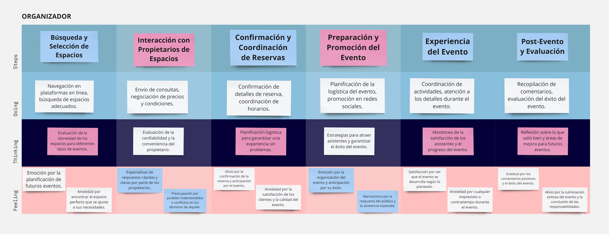

# Capítulo II: Requirements Elicitation & Analysis
## 2.1. Competidores
Después de realizar una investigación de mercado, hemos identificado tres plataformas que ofrecen características similares a las de nuestra aplicación para conectar propietarios de espacios con organizadores de eventos. Estas son:
1. **Airbnb:**
Es una plataforma en línea fundada en 2008 que revolucionó la industria hotelera al ofrecer una alternativa a los hoteles tradicionales. Permite a los usuarios alquilar alojamientos a corto plazo, desde habitaciones individuales hasta casas completas, en más de 191 países. Facilita la conexión entre anfitriones que desean alquilar sus propiedades y huéspedes en busca de alojamiento temporal.

                

2. **Vrbo:**
Es una plataforma en línea fundada en 1995 que facilita el alquiler de alojamientos vacacionales directamente a través de los propietarios. El nombre significa "Vacation Rentals by Owner" (Alquileres Vacacionales por Propietario). Es uno de los principales sitios web para alquileres vacacionales en todo el mundo, donde los usuarios pueden buscar y reservar casas, apartamentos, cabañas y villas en una variedad de destinos. Esto les permite encontrar opciones que se adapten a sus necesidades y preferencias.

                

3. **Booking:**
Es una plataforma que permite a los usuarios reservar alojamiento en hoteles, hostales, apartamentos y otros tipos de alojamiento en todo el mundo. También ofrece la posibilidad de reservar vuelos, alquilar coches y reservar actividades turísticas. Booking.com es una de las mayores plataformas de reserva de alojamiento en línea y ofrece una amplia variedad de opciones para viajeros de todo tipo. Los usuarios pueden buscar alojamientos según sus preferencias y presupuesto, y realizar reservas de manera rápida y conveniente a través de la plataforma.

                

### 2.1.1. Análisis competitivo
<table>
  <tr>
    <th colspan="7" valign="top"><b>Competitive Analysis Landscape</b></th>
  </tr>
  <tr>
    <td colspan="2" rowspan="2">¿Por qué llevar a cabo este análisis?</td>
    <td colspan="5">Escriba en el recuadro la pregunta que busca responder o el objetivo de este análisis.</td>
  </tr>
  <tr>
    <td colspan="5">Este análisis se realizó con la finalidad de poder identificar a nuestros potenciales competidores e idear estrategias y tácticas para diferenciarnos de estos.</td>
  </tr>
  <tr>
    <td colspan="3">(En la cabecera colocar por cada competidor nombre y logo)</td>
    <td colspan="1" valign="top" style="font-weight: bold;">
        AlquilaFácil
         
        

                
        

    <td colspan="1" valign="top" style="font-weight: bold;">
      Airbnb
        

                
        

    </td>
    <td colspan="1" valign="top" style="font-weight: bold;">
      Vrbo
        

                
            

        </td>
    <td colspan="1" valign="top" style="font-weight: bold;" >
      Booking
        

                
        

    </td>
  </tr>
  <tr>
    <td colspan="1" rowspan="2">
Perfil
</td>
    <td colspan="2">Overview</td>
    <td colspan="1" valign="top">Es una plataforma en línea que facilita el alquiler de una amplia gama de espacios para eventos, desde salones de eventos hasta casas y alojamientos temporales. Con una interfaz fácil de usar, conecta a propietarios con organizadores, ofreciendo una solución conveniente y eficiente para satisfacer las necesidades de ambos.</td>
    <td colspan="1" valign="top">Plataforma en línea que revoluciona el alquiler de alojamientos a corto plazo, conectando anfitriones y huéspedes en todo el mundo. Ofrece una amplia variedad de opciones de alojamiento, desde habitaciones individuales hasta casas completas.</td>
    <td colspan="1" valign="top">Plataforma en línea que permite a los usuarios buscar y reservar alojamientos vacacionales directamente a través de propietarios. Ofrece una variedad de opciones de alojamiento, como casas, apartamentos, cabañas y villas, en diferentes destinos, adaptándose a las necesidades y preferencias de los viajeros.</td>
    <td colspan="1" valign="top">Booking.com es una plataforma líder para reservar alojamiento y actividades turísticas en todo el mundo. Ofrece una amplia variedad de opciones, desde hoteles hasta apartamentos, y facilita la búsqueda y reserva según las preferencias y presupuesto de los usuarios.</td>
  </tr>
  <tr>
    <td colspan="2">Ventaja competitiva</td>
    <td colspan="1" valign="top">Proporciona una solución completa para la planificación de eventos, ofreciendo una amplia gama de espacios para eventos y una plataforma intuitiva para gestionar reservas. Con características como registro gratuito de espacios, búsqueda avanzada y servicio al cliente dedicado, Alquila Fácil simplifica el proceso de planificación de eventos para organizadores y propietarios de espacios.</td>
    <td colspan="1" valign="top">Ofrece una amplia variedad de alojamientos en todo el mundo, desde habitaciones individuales hasta casas completas, junto con experiencias locales únicas organizadas por anfitriones. Esto permite a los viajeros personalizar su experiencia y sumergirse en la cultura local.</td>
    <td colspan="1" valign="top">Se especializa en alquileres vacacionales directamente a través de propietarios, brindando a los viajeros la oportunidad de disfrutar de una experiencia más auténtica y personalizada. Con una amplia selección de alojamientos vacacionales, Vrbo ofrece opciones para todos los gustos y presupuestos.</td>
    <td colspan="1" valign="top">Destaca por su amplia oferta de alojamiento y servicios, que incluyen hoteles, vuelos, alquiler de coches y actividades turísticas. La plataforma fácil de usar permite a los usuarios encontrar y reservar alojamiento de manera rápida y sencilla, ofreciendo una solución integral para los viajeros.</td>
  </tr>
  <tr>
    <td colspan="1" rowspan="2">
Perfil de Marketing
</td>
    <td colspan="2">Mercado objetivo</td>
    <td colspan="1" valign="top">Dirigido a organizadores de eventos adultos de 18 años en adelante que buscan espacios para eventos sociales, corporativos o especiales, como bodas, conferencias, fiestas de empresa, entre otros. Además, atrae a empresas y organizaciones que buscan espacios para eventos corporativos y reuniones profesionales dirigidas a un público adulto.</td>
    <td colspan="1" valign="top">Se centra en viajeros adultos de 18 años en adelante, ofreciendo una amplia variedad de alojamientos en todo el mundo, desde habitaciones individuales hasta casas completas, para adaptarse a diferentes necesidades y preferencias de viaje. Además, apunta a grupos de amigos, parejas y familias adultas que buscan opciones de alojamiento que se ajusten a sus requerimientos y presupuestos durante sus vacaciones o escapadas.</td>
    <td colspan="1" valign="top">Está dirigido a familias y grupos de amigos adultos de 18 años en adelante que buscan alquilar casas, villas o cabañas para vacaciones o escapadas grupales. Además, atrae a parejas y grupos de amigos adultos que buscan alquilar alojamientos vacacionales para eventos especiales, como bodas, reuniones familiares o celebraciones de cumpleaños.</td>
    <td colspan="1" valign="top">Orientado a viajeros adultos de 18 años en adelante, busca ofrecer una amplia gama de opciones de alojamiento para adaptarse a diversas necesidades y preferencias durante sus viajes. También se dirige a personas que viajan por negocios, parejas en escapadas románticas, grupos de amigos en vacaciones y familias en busca de opciones de alojamiento cómodas y convenientes.</td>
  </tr>
  <tr>
    <td colspan="2">Estrategias de marketing</td>
    <td colspan="1" valign="top">Alquila Fácil destaca con marketing de contenidos, participación en eventos de la industria y alianzas con proveedores de servicios de eventos para ofrecer soluciones completas a organizadores de eventos.</td>
    <td colspan="1" valign="top">Airbnb emplea campañas publicitarias en redes sociales y colaboraciones con influencers para promocionar destinos y experiencias únicas. También utiliza programas de referidos para aumentar su base de usuarios.</td>
    <td colspan="1" valign="top">Vrbo se centra en contenido educativo en su sitio web, colaboraciones con agencias de viajes y ofertas exclusivas para atraer a familias y grupos de amigos a reservar a través de su plataforma.</td>
    <td colspan="1" valign="top">Booking.com utiliza estrategias de SEO y SEM, junto con programas de fidelización, para atraer tráfico y fomentar la lealtad del cliente a través de una experiencia personalizada.</td>
  </tr>
  <tr>
    <td colspan="1" rowspan="3">
Perfil de Producto
</td>
    <td colspan="2">Productos & Servicios</td>
    <td colspan="1" valign="top">Aplicación web que conecta a propietarios de diversos espacios, como salones de eventos, jardines y locales comerciales, con organizadores de eventos que buscan alquilar estos espacios para celebrar eventos sociales, corporativos o especiales. Proporciona una variedad de herramientas y servicios para facilitar la búsqueda, reserva y gestión de espacios para eventos.</td>
    <td colspan="1" valign="top">Plataforma en línea donde los usuarios pueden alquilar una variedad de alojamientos a corto plazo, desde habitaciones individuales hasta casas completas, en todo el mundo. Además de alojamiento, Airbnb también proporciona experiencias locales únicas organizadas por anfitriones, como recorridos gastronómicos, clases de cocina y excursiones.</td>
    <td colspan="1" valign="top">Plataforma para alquilar alojamientos vacacionales directamente a través de los propietarios. Los usuarios pueden encontrar y reservar una amplia gama de propiedades, que van desde casas y apartamentos hasta cabañas y villas, para sus vacaciones o escapadas en todo el mundo.</td>
    <td colspan="1" valign="top">Plataforma en línea que permite a los usuarios reservar una variedad de alojamientos, incluyendo hoteles, hostales, apartamentos y otros tipos de hospedaje en todo el mundo. Además de alojamiento, Booking.com ofrece la posibilidad de reservar vuelos, alquilar coches y reservar actividades turísticas para completar la experiencia de viaje del usuario.</td>
  </tr>
  <tr>
      <td colspan="2">Precios & Costos</td>
      <td colspan="1" valign="top">Los precios de AlquilaFácil varían dependiendo del lugar, el tamaño de la propiedad, servicios, y el tiempo de uso.</td>
      <td colspan="1" valign="top">El costo promedio puede variar significativamente dependiendo de varios factores, como la ubicación, el tipo de alojamiento, la época del año y la demanda local.</td>
      <td colspan="1" valign="top">Los precios en VRBO pueden variar significativamente dependiendo de la ubicación, el tamaño de la propiedad, las comodidades ofrecidas y la temporada del año.</td>
      <td colspan="1" valign="top">Los precios pueden variar significativamente según la ubicación, la temporada, la demanda y el tipo de alojamiento.</td>
  </tr>
  <tr>
    <td colspan="2">Canales de distribución (Web y/o Móvil)</td>
    <td colspan="1" valign="top">Redes sociales y aplicación web donde los usuarios pueden poner en renta su espacio o alquilar un espacio para eventos.</td>
    <td colspan="1" valign="top">Sitio web de Airbnb, aplicación móvil de Airbnb, socios afiliados y asociaciones, redes sociales y marketing digital.</td>
    <td colspan="1" valign="top">Principalmente su sitio web y su aplicación móvil, así como acuerdos de distribución con otros sitios web de viajes o agencias de viajes en línea.</td>
    <td colspan="1" valign="top">Sitio web de Booking.com, aplicación móvil de Booking, agencias de viajes en línea, alianzas con compañías de viajes, afiliados y asociados.</td>
  </tr>
  <tr>
    <td colspan="1" rowspan="5">
Análisis SWOT
</td>
    <td colspan="6">Realice esto para su startup y sus competidores. Sus fortalezas deberían apoyar sus oportunidades y contribuir a lo que ustedes definen como su posible ventaja competitiva.</td>
  </tr>
  <tr>
    <td colspan="2">Fortalezas</td>
    <td colspan="1" valign="top">Solución completa para la planificación de eventos.</td>
    <td colspan="1" valign="top">Gran comunidad de anfitriones y usuarios.</td>
    <td colspan="1" valign="top">Variedad de alojamientos en todo el mundo.</td>
    <td colspan="1" valign="top">Interfaz fácil de usar y experiencia intuitiva del usuario.</td>
  </tr>
  <tr>
    <td colspan="2">Debilidades</td>
    <td colspan="1" valign="top">Dependencia de la disponibilidad de espacios para eventos.</td>
    <td colspan="1" valign="top">Dependencia de la reputación y opiniones de los usuarios.</td>
    <td colspan="1" valign="top">Posible saturación del mercado de alquiler vacacional.</td>
    <td colspan="1" valign="top">Competencia intensa con otras plataformas de alquiler de alojamiento.</td>
  </tr>
  <tr>
    <td colspan="2">Oportunidades</td>
    <td colspan="1" valign="top">Expansión a nuevos mercados y nichos de eventos.</td>
    <td colspan="1" valign="top">Desarrollo de nuevas características y servicios para mejorar la experiencia del usuario.</td>
    <td colspan="1" valign="top">Alianzas estratégicas con proveedores de servicios de eventos.</td>
    <td colspan="1" valign="top">Aprovechamiento de la tendencia creciente del turismo y los viajes.</td>
  </tr>
  <tr>
    <td colspan="2">Amenazas</td>
    <td colspan="1" valign="top">Cambios en la regulación de alquileres vacacionales y eventos.</td>
    <td colspan="1" valign="top">Posible disminución de la demanda de viajes debido a crisis económicas o sanitarias.</td>
    <td colspan="1" valign="top">Innovaciones tecnológicas que podrían ser adoptadas por competidores.</td>
    <td colspan="1" valign="top">Posible pérdida de confianza del usuario debido a problemas de seguridad o calidad del servicio.</td>
  </tr>
</table>

### 2.1.2. Estrategias y tácticas frente a competidores

- **Diferenciación de la plataforma:** Identificaremos y destacaremos las características únicas de AlquilaFácil que la distinguen de otras plataformas de alquiler de espacios para eventos. Esto podría incluir herramientas innovadoras para la gestión de reservas, una interfaz fácil de usar que simplifica el proceso de búsqueda y reserva de espacios, y características adicionales como la personalización de eventos y la integración de servicios de catering o entretenimiento.

- **Comunidad activa:** Fomentaremos una comunidad activa de propietarios de espacios, organizadores de eventos y usuarios en la plataforma de AlquilaFácil. Ofreceremos espacios para que compartan sus experiencias, recomienden espacios y eventos, e interactúen entre sí. Esto no solo aumentará el compromiso de los usuarios, sino que también generará confianza y lealtad hacia la plataforma.

- **Marketing dirigido:** Utilizaremos estrategias de marketing digital dirigidas para llegar a nuestro público objetivo. Esto podría incluir publicidad en redes sociales dirigida a organizadores de eventos y propietarios de espacios, colaboraciones con organizadores de eventos locales e influencers en la industria de eventos, y la participación en ferias comerciales y eventos relevantes para promover la plataforma.

- **Monetización creativa:** Exploraremos diferentes modelos de monetización para diversificar nuestras fuentes de ingresos y ofrecer opciones flexibles a nuestros usuarios. Además de las tarifas estándar por el uso de la plataforma, podríamos ofrecer servicios premium para propietarios de espacios, como la promoción destacada de sus listados o herramientas avanzadas de gestión de reservas. También podríamos considerar la inclusión de servicios adicionales, como la coordinación de catering o la organización de servicios de entretenimiento, con una tarifa adicional. La publicidad no intrusiva y los patrocinios de eventos también podrían ser oportunidades de monetización a explorar.

## 2.2. Entrevistas
### 2.2.1. Diseño de entrevistas

En esta sección se han definido una cierta cantidad de preguntas para nuestros segmentos objetivos, con la finalidad de obtener información cualitativa como opiniones o descripciones. Esta información nos será de gran ayuda en el desarrollo de nuestra solución.

**Preguntas generales:**

1. ¿Cuál es tu nombre?
2. ¿Qué edad tienes?
3. ¿Dónde vives actualmente?
4. ¿A qué te dedicas?

**Preguntas Segmento 1: Propietarios**

1. ¿Qué desafíos enfrenta actualmente al promocionar y gestionar reservas para su espacio?
2. ¿Qué tipo de propiedades suele alquilar o publicitar? (apartamentos, casas, locales comerciales, terrenos, etc.)
3. De tener experiencia en alquilar su propiedad, ¿cómo ha realizado los pagos de los centros en alquiler?
4. ¿Cómo promociona su espacio para atraer a potenciales clientes? ¿Qué estrategias de marketing ha encontrado más efectivas?
5. ¿Qué te parece más importante al alquilar una propiedad: la facilidad de uso de la plataforma, la seguridad de las transacciones, la diversidad de opciones disponibles, u otros aspectos?
6. ¿Cuáles son las principales características que busca en una plataforma de alquiler de espacios para eventos?
7. ¿Qué incentivos o beneficios podrían motivar a utilizar una plataforma de alquiler de espacios de manera más frecuente? 
8. ¿Ha tenido alguna experiencia previa con plataformas similares de alquiler de espacios para eventos?¿Qué aspectos le gustaron? 
9. ¿Estarías dispuesto(a) a pagar una tarifa por utilizar una aplicación que te ayude a publicitar o alquilar tu propiedad de manera más eficiente?
10. ¿Qué sugerencias o mejoras tendrías para una aplicación de este tipo que aún no estén disponibles en otras plataformas similares?

**Preguntas Segmento 1: Organizadores**

1. ¿Qué tipo de propiedades alquila regularmente para sus reuniones?
2. ¿Alguna vez has necesitado un lugar de encuentro o festivo de emergencia?
3. ¿Qué tipo de información te gustaría que viniera en las características del local/propiedad? (ej. licencias de eventos, capacidad máxima de gente, etc.)
4. Organizando eventos, ¿alguna vez tuvo un problema grave con las políticas de cancelación?
5. ¿Eres promotor de algún tipo de evento recurrente?
6. ¿Cada cuanto recurres a alquilar lugares o a usarlos?
7. ¿Ves necesario una plataforma como Alquilafacil?
8. ¿De qué maneras ves útil Alquilafacil y cada cuanto lo utilizamos?
9. ¿Hay alguna otra consideración o solicitud especial que crea que deba adicionarse para hacer un mejor servicio?
10. ¿Qué tan importante es para ti la flexibilidad de horarios al momento de reservar un espacio para tu evento?

### 2.2.2. Registro de entrevistas

**Segmento propietario:**

**Entrevista 1:**

Nombres: Claudia Cecilia

Apellidos: Cañamero Vivas

Edad: 46

Lugar de residencia: Lima, Perú

Entrevistador: Italo Luna Capuñay

Evidencia de la entrevista: 

Enlace de entrevista: https://upcedupe-my.sharepoint.com/:v:/g/personal/u202213375_upc_edu_pe/Ecl6kWhXShZEs4eoqqBltusBdurPIhKjNtqGXOSbDAXZGw?e=bsjJbh&nav=eyJyZWZlcnJhbEluZm8iOnsicmVmZXJyYWxBcHAiOiJTdHJlYW1XZWJBcHAiLCJyZWZlcnJhbFZpZXciOiJTaGFyZURpYWxvZy1MaW5rIiwicmVmZXJyYWxBcHBQbGF0Zm9ybSI6IldlYiIsInJlZmVycmFsTW9kZSI6InZpZXcifX0%3D

Resumen de la entrevista:

Entrevistamos a Claudia Cañamero, una señora de 46 años que es podóloga y propietaria de locales que alquila para distintos eventos. Claudia nos comentó que actualmente alquila su local para diversos eventos recreativos, pero que carece de organización en su proceso de promoción. En la actualidad, utiliza principalmente las redes sociales para promocionar su local y no emplea otras estrategias.

Nos mencionó que le sería muy útil una plataforma para promocionar su local, ya que tiene poco conocimiento sobre las existentes. Aunque mencionó algunas plataformas que conoce, no está muy informada sobre ellas.

En cuanto a la comunicación con sus clientes, que son los organizadores de eventos, Claudia nos comentó que no es muy buena. Tema que pueda haber estafas o malos acuerdos en los contratos, por lo que le gustaría que la plataforma fuera transparente en ese aspecto y que la comunicación con sus clientes fuera eficiente y fluida.

Con respecto a las suscripciones, Claudia nos dijo que estaría dispuesta a pagar por una mejor experiencia en la plataforma.

Por último, en cuanto a la webapp, nos agregó que le gustaría que fuera fácil de usar. No le gustaría entrar y perderse sin saber cómo usarla; preferiría interfaces intuitivas y no demasiado complicadas.

**Entrevista 2:**

Nombres:

Apellidos:

Edad: 

Lugar de residencia:

Entrevistador:

Evidencia de la entrevista: 

Enlace de entrevista:

Resumen de la entrevista:

**Entrevista 3:**

Nombres:

Apellidos:

Edad: 

Lugar de residencia:

Entrevistador:

Evidencia de la entrevista: 

Enlace de entrevista:

Resumen de la entrevista:

**Entrevista 4:**

Nombres:

Apellidos:

Edad: 

Lugar de residencia:

Entrevistador:

Evidencia de la entrevista: 

Enlace de entrevista:

Resumen de la entrevista:

**Entrevista 5:**

Nombres:

Apellidos:

Edad: 

Lugar de residencia:

Entrevistador:

Evidencia de la entrevista: 

Enlace de entrevista:

Resumen de la entrevista:

**Segmento organizador:**

**Entrevista 1:**

Nombres: Rodrigo Alejandro

Apellidos: Aguilar Castillo

Edad: 19

Lugar de residencia: San Isidro, Lima

Entrevistador: Italo Luna Capuñay

Evidencia de la entrevista: 

Enlace de entrevista: https://upcedupe-my.sharepoint.com/:v:/g/personal/u202213375_upc_edu_pe/ER2a2fW6t3JFhfh2Ae_n4G8BhjhRjm6abPnbfM_6pqnVSw?e=f2oIVi&nav=eyJyZWZlcnJhbEluZm8iOnsicmVmZXJyYWxBcHAiOiJTdHJlYW1XZWJBcHAiLCJyZWZlcnJhbFZpZXciOiJTaGFyZURpYWxvZy1MaW5rIiwicmVmZXJyYWxBcHBQbGF0Zm9ybSI6IldlYiIsInJlZmVycmFsTW9kZSI6InZpZXcifX0%3D

Resumen de la entrevista:

Entrevistamos a Rodrigo Aguilar, un joven de 16 años que estudia la carrera de Ingeniería de Software. Rodrigo nos comentó que le gusta adquirir espacios para diversos eventos recreativos. En la actualidad, utiliza principalmente las redes sociales y sitios web como Airbnb y otros para encontrar locales.

Rodrigo destacó que una interfaz intuitiva sería excelente para poder utilizar la plataforma. Para él, lo más importante es la comunicación con el propietario, ya que no le gusta tener conflictos en el contrato o malos entendidos.

En cuanto a la variedad de tipos de espacios, nos comentó que mayormente le gustan las casas con piscinas, que utiliza para reuniones familiares, fines de semana con su familia o también con sus amigos. Dice que reserva este tipo de sitios con frecuencia, ya que le gusta pasar tiempo con su familia o amigos.

Con respecto a las suscripciones, Rodrigo nos dijo que estaría dispuesto a pagar por una mejor experiencia en la plataforma.

Por último, en cuanto a la webapp, nos comentó que tendría futuro si hubiera variedad, fuera fácil de reservar y, lo más importante, que fuera una ayuda para poder reservar sus espacios y disfrutar de sus momentos libres.

**Entrevista 2:**

Nombres:

Apellidos:

Edad: 

Lugar de residencia:

Entrevistador:

Evidencia de la entrevista: 

Enlace de entrevista:

Resumen de la entrevista:

**Entrevista 3:**

Nombres:

Apellidos:

Edad: 

Lugar de residencia:

Entrevistador:

Evidencia de la entrevista: 

Enlace de entrevista:

Resumen de la entrevista:

**Entrevista 4:**

Nombres:

Apellidos:

Edad: 

Lugar de residencia:

Entrevistador:

Evidencia de la entrevista: 

Enlace de entrevista:

Resumen de la entrevista:

**Entrevista 5:**

Nombres:

Apellidos:

Edad: 

Lugar de residencia:

Entrevistador:

Evidencia de la entrevista: 

Enlace de entrevista:

Resumen de la entrevista:

### 2.2.3. Análisis de entrevistas

## 2.3. Needfinding

### 2.3.1. User Personas

**Segmento propietario:**

**Segmento organizador:**

### 2.3.2. User Task Matrix

<table align="center" border="1" width="90%" style="text-align:center;">
    <tr>
        <td></td>
        <td colspan=2>
            <b>User Persona</b>
        </td>
    </tr>
    <tr>
        <td></td>
        <td colspan=2>
            <b>Claudia Cañamero</b>  Propietaria de un local para eventos
        </td>
    </tr>
    <tr>
        <td>
            <b>Task</b>
        </td>
        <td>
            <b>Frequency</b>
        </td>
        <td>
            <b>Importance</b>
        </td>
    </tr>
    <tr>
        <td>
            Gestionar reservas y coordinar eventos
        </td>
        <td>
            High
        </td>
        <td>
            High
        </td>
    </tr>
    <tr>
        <td>
            Promocionar el local en redes sociales y otros canales de marketing
        </td>
        <td>
            High
        </td>
        <td>
            High
        </td>
    </tr>
    <tr>
        <td>
            Mantener el local en óptimas condiciones de limpieza y mantenimiento
        </td>
        <td>
            High
        </td>
        <td>
            High
        </td>
    </tr>
    <tr>
        <td>
            Establecer comunicación efectiva con clientes y proveedores
        </td>
        <td>
            High
        </td>
        <td>
            High
        </td>
    </tr>
    <tr>
        <td>
            Explorar nuevas oportunidades de negocio y crecimiento
        </td>
        <td>
            Medium
        </td>
        <td>
            Medium
        </td>
    </tr>
</table>

  

<table align="center" border="1" width="90%" style="text-align:center;">
    <tr>
        <td></td>
        <td colspan=2>
            <b>User Persona</b>
        </td>
    </tr>
    <tr>
        <td></td>
        <td colspan=2>
            <b>Rodrigo Aguilar</b>  Organizador de Eventos
        </td>
    </tr>
    <tr>
        <td>
            <b>Task</b>
        </td>
        <td>
            <b>Frequency</b>
        </td>
        <td>
            <b>Importance</b>
        </td>
    </tr>
    <tr>
        <td>
            Buscar y reservar espacios para eventos
        </td>
        <td>
            High
        </td>
        <td>
            High
        </td>
    </tr>
    <tr>
        <td>
            Comunicarse con los propietarios de los espacios
        </td>
        <td>
            High
        </td>
        <td>
            High
        </td>
    </tr>
    <tr>
        <td>
            Buscar variedad en los tipos de espacios disponibles
        </td>
        <td>
            High
        </td>
        <td>
            High
        </td>
    </tr>
    <tr>
        <td>
            Reservar espacios para diferentes tipos de eventos
        </td>
        <td>
            High
        </td>
        <td>
            High
        </td>
    </tr>
    <tr>
        <td>
            Estar dispuesto a pagar por una mejor experiencia en la plataforma
        </td>
        <td>
            Medium
        </td>
        <td>
            Medium
        </td>
    </tr>
    <tr>
        <td>
            Utilizar una plataforma fácil de usar e intuitiva
        </td>
        <td>
            High
        </td>
        <td>
            High
        </td>
    </tr>
</table>

### 2.3.3. User Journey Mapping

**Segmento propietario:**

 

**Segmento organizador:**

 

### 2.3.4. Empathy Mapping

A continuación se pueden apreciar los Empathy Mapping de los segmentos objetivos.

**Segmento propietario:**

**Segmento organizador:**

### 2.3.5. As-is Scenario Mapping

**Segmento propietario:**

**Segmento organizador:**

## 2.4. Ubiquitous Language

- **Landing Page:** La página web inicial a la que llegan los usuarios cuando visitan el sitio de reserva de viajes. En el lenguaje ubicuo, podría ser simplemente "Página de Inicio" o "Página Principal".

- **Plataforma:** Se refiere a la infraestructura tecnológica sobre la cual se construye el servicio de reserva de viajes. En el lenguaje ubicuo, podría simplemente llamarse "Sistema" o "Plataforma de Reservas".

- **Perfil**: La información personal y las preferencias de un usuario registrado en la plataforma de reserva de viajes. En el lenguaje ubicuo, podría ser simplemente "Cuenta de Usuario" o "Perfil de Usuario".

- **Itinerario:** La lista de actividades o eventos planificados para un viaje específico. En el lenguaje ubicuo, podría ser simplemente "Plan de Viaje" o "Ruta".

- **Tarifa:** El costo asociado con un servicio de viaje, como un boleto de avión, un hotel o un alquiler de automóvil. En el lenguaje ubicuo, podría ser "Precio" o "Costo".

- **Disponibilidad:** La cantidad de espacios o servicios disponibles para reservar en un momento dado. En el lenguaje ubicuo, podría ser "Capacidad" o "Disponibilidad de Servicio".

- **Confirmación:** El proceso de validar una reserva y asegurar que se haya completado correctamente. En el lenguaje ubicuo, podría ser "Confirmación de Reserva" o "Confirmar Viaje".

- **Cancelación:** La acción de anular una reserva existente. En el lenguaje ubicuo, podría ser "Cancelar Reserva" o "Anular Viaje".

- **Destino:** El lugar al que se planea viajar o donde se encuentra un servicio específico, como un hotel. En el lenguaje ubicuo, podría ser simplemente "Lugar de Destino" o "Ubicación".

- **Calendario:** Una herramienta para visualizar fechas y horarios disponibles para reservas. En el lenguaje ubicuo, podría ser "Agenda" o "Calendario de Disponibilidad".

- **Pago:** La transacción financiera necesaria para confirmar una reserva. En el lenguaje ubicuo, podría ser simplemente "Pago" o "Transacción".